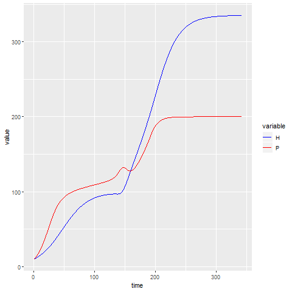

```{r setup, include=FALSE}
knitr::opts_chunk$set(echo = FALSE, message = FALSE, # hide code and messages
                      cache=TRUE, autodep=TRUE) 
source("library/hpModel.run.R")
source("library/hpModel.exploration.R")
source("library/hpModel.plot.R")
require(reshape2)
require(ggplot2)
require(scales)

run.table <- function(run.result)
{
  run.parnames <- names(run.result$PARS)
  run.parvalues <- c()
  for (i in 1:length(run.result$PARS))
  {
    run.parvalues <- c(run.parvalues, run.result$PARS[[i]])
  }
  knitr::kable(cbind(run.parnames, run.parvalues), col.names = c("parameter", "values"))
}

exp.table <- function(exp.results)
{
  exp.parnames <- c()
  exp.values <- c()
  for (i in 1:17)
  {
    exp.parnames <- c(exp.parnames, names(exp.results)[i])
    value <- levels(factor(exp.results[[i]]))
    if (length(value) > 1) 
    {
      value <- as.numeric(as.character(value))
      value <- paste(min(value), "-", max(value), "(sample=", length(value), ")")
    }
    exp.values <- c(exp.values, value)
  }
  knitr::kable(cbind(exp.parnames, exp.values), col.names = c("parameter", "values"))
}
```

## Single runs

### Parameter exploration - experiment Um-max:


```{r run-default, cache=TRUE, results = 'hide'}
run1 <- hpModel.run(
  # growth rate
  r.h = 0.05,
  # 0.05
  r.p = 0.1,
  # 0.1
  # basic resources
  max.h = 80,
  # 80
  max.p = 100,
  # 100
  # utility
  Um.ph = 1.7,
  # 1.7
  Um.hp = 1,
  # 1
  # number of types
  n.h = 10,
  # 10
  n.p = 10,
  # 10
  # undirected variation
  v.h = 0.15,
  # 0.15
  v.p = 0.15,
  # 0.15
  # initial conditions
  iniH = 10,
  # 10
  iniP = 10,
  # 10
  # proportion of mean utility
  Ump.ph = 10,
  # 10
  Ump.hp = 100,
  # 100
  # proportion of mean basic resources
  Kmp.h = 100,
  # 100
  Kmp.p = 100,
  # 100
  # settings
  MaxArea = 200,
  maxIt = 1000,
  tol = 4,
  saveTrajectories = TRUE,
  PLOT = F,
  SLEEP = 0.1
)
```

```{r run-default-pars, cache=TRUE, dependson='run-default'}
run.table(run1)
```


```{r run-default-multiplot, cache=TRUE, dependson='run-default', fig.width=8, fig.height=8}
hpModel.plot(run1)
```


```{r run-default-end, cache=TRUE, dependson='run-default'}
run1$END
```

```{r run-default-plot, results = 'hide', cache=TRUE, dependson='run-default'}
g.data <-
  data.frame(H = run1$TRAJECTORIES$H, P = run1$TRAJECTORIES$P)[!is.na(run1$TRAJECTORIES$H), ]

g.data$time <- 1:nrow(g.data)

g.data <- melt(g.data, measure.vars = c('H', 'P'))

g1 <- 
  ggplot(g.data,
         aes(x = time, y = value, colour = variable)) +
  geom_line() +
  scale_color_manual(values = c('blue', 'red'))

#svg('plots/1_singleRun.svg', width=10, height=10)
png("plots/1_singleRun.png")
g1
dev.off()
```

```{r fig-Um-max-plot, echo=FALSE}

```
