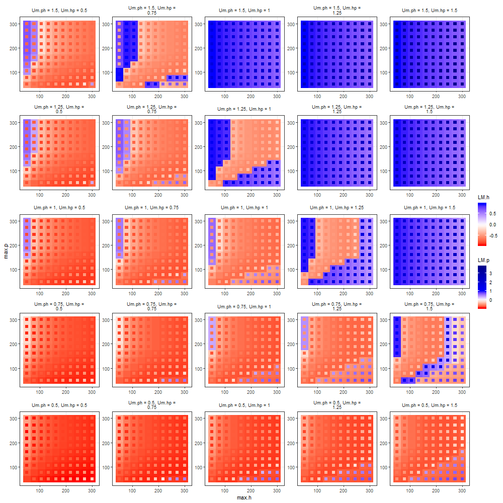
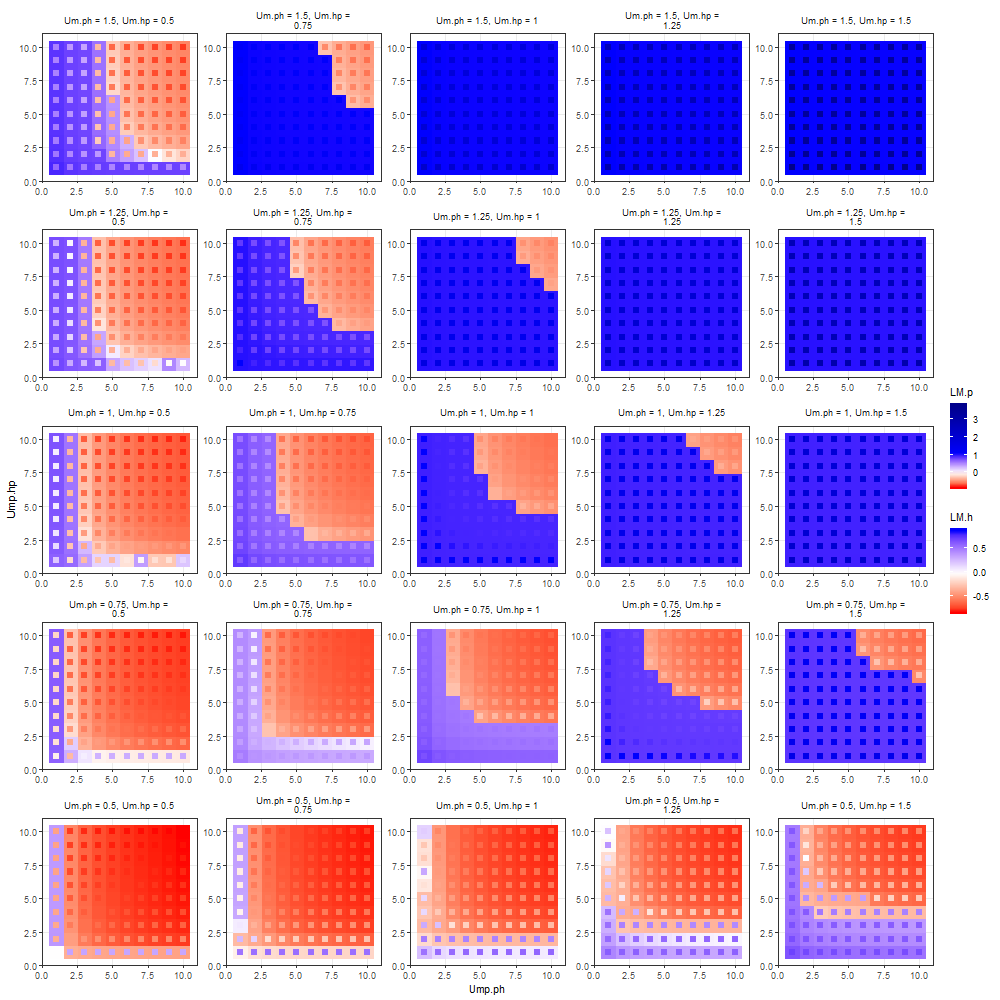
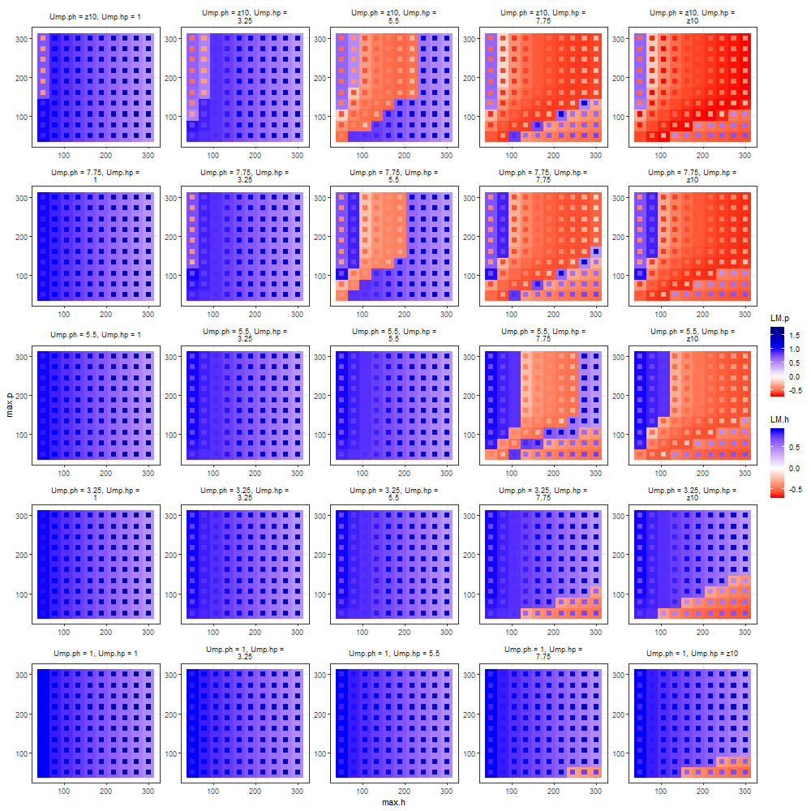

## Four parameter exploration

### Parameter exploration - experiment Um-max: 

Utility between type N humans and plants (`Um.ph`, `Um.hp`) *versus* utility of other resources (`max.p`, `max.h`)

```{r Um-max-values, cache=TRUE}

# Um.ph, Um.hp
SEQ1 <- seq(0.5, 1.5, length.out=5)
# max.h, max.p
SEQ2 <- seq(50, 300, length.out=10)

```

```{r Um-max-exp, cache=TRUE, dependson='Um-max-values', results = 'hide'}
exp1 <- hpModel.exploration(
  # growth rate 
  r.h = 0.15, 
  r.p = 0.15, 
  # basic resources:
  # population of type 1 that can be sustained by resources independent of HP relationship
  max.h = SEQ2, 
  max.p = SEQ2, 
  # Utility of individuals of type N
  Um.ph = SEQ1,
  Um.hp = SEQ1,
  # number of types
  n.h = 10,         
  n.p = 10,        
  # undirected variation 
  v.h = 0.15,
  v.p = 0.15,
  # initial populations
  iniH = 10,
  iniP = 10,
  # proportion of mean utility:
  # How less utility has type 1 individuals in relation to type N
  Ump.ph = 10, 
  Ump.hp = 10, 
  # How less population of type N can be sustained by resources 
  # # independent of HP relationship in relation to type 1
  Kmp.h = 10, 
  Kmp.p = 10, 
  # maximum local area to be used by plants (multiplier or scaling effect)
  MaxArea = 200)
```

```{r Um-max-table, cache=TRUE, dependson='Um-max-exp'}
exp.table(exp1)
```

```{r Um-max-plot, results = 'hide', cache=TRUE, dependson='Um-max-exp'}

g1 <- ggplot(exp1, aes(x = max.h, y = max.p)) + 
  geom_raster(aes(fill = LM.h)) + 
  geom_point(aes(color = LM.p), shape = 15, size = 2.5) + # 1.75
  #geom_point(aes(size = time), shape = 't') +
  scale_fill_gradientn(
     colors=c('red','white','blue'),
     values=rescale(c(min(exp1$LM.h), 0, max(exp1$LM.h))),
     limits=c(min(exp1$LM.h), max(exp1$LM.h))) + 
  scale_color_gradientn(
     colors=c('red','white','blue', 'darkblue'),
     values=rescale(c(min(exp1$LM.p), 0, 1, max(exp1$LM.p))),
     limits=c(min(exp1$LM.p), max(exp1$LM.p))) + 
  theme_bw() + # + theme(legend.position="none")
  theme(strip.background = element_rect(fill = NA, colour = NA), panel.grid.minor =  element_blank()) +
  facet_wrap(vars(paste('Um.ph = ', Um.ph), paste('Um.hp = ', Um.hp)), 
             as.table = FALSE,
             scales='free', ncol=5, 
             labeller = label_wrap_gen(multi_line=FALSE))

png('plots/4_Um-max-plot.png', width=1000, height=1000); g1; dev.off()

```

```{r fig-Um-max-plot, echo=FALSE}

```

### Parameter exploration - experiment Um-Ump: 

Utility between type N humans and plants (`Um.ph`, `Um.hp`) *versus* proportion of utility of type 1 humans and plants less than type N (`Ump.ph`, `Ump.hp`)

```{r Um-Ump-values, cache=TRUE}

# Um.ph, Um.hp
SEQ3 <- seq(0.5, 1.5, length.out=5)
# max.h, max.p
SEQ4 <- seq(1, 10, length.out=10)

```

```{r Um-Ump-exp, cache=TRUE, dependson='Um-Ump-values', results = 'hide'}
exp2 <- hpModel.exploration(
  # growth rate 
  r.h = 0.15, 
  r.p = 0.15, 
  # basic resources:
  # population of type 1 that can be sustained by resources independent of HP relationship
  max.h = 100, 
  max.p = 100, 
  # Utility of individuals of type N
  Um.ph = SEQ3,
  Um.hp = SEQ3,
  # number of types
  n.h = 10,         
  n.p = 10,        
  # undirected variation 
  v.h = 0.15,
  v.p = 0.15,
  # initial populations
  iniH = 10,
  iniP = 10,
  # proportion of mean utility:
  # How less utility has type 1 individuals in relation to type N
  Ump.ph = SEQ4, 
  Ump.hp = SEQ4, 
  # How less population of type N can be sustained by resources 
  # # independent of HP relationship in relation to type 1
  Kmp.h = 10, 
  Kmp.p = 10, 
  # maximum local area to be used by plants (multiplier or scaling effect)
  MaxArea = 200)
```

```{r Um-Ump-table, cache=TRUE, dependson='Um-Ump-exp'}
exp.table(exp2)
```

```{r Um-Ump-plot, results = 'hide', cache=TRUE, dependson='Um-Ump-exp'}

g2 <- ggplot(exp2, aes(x = Ump.ph, y = Ump.hp)) + 
  geom_raster(aes(fill = LM.h)) + 
  geom_point(aes(color = LM.p), shape = 15, size = 2.5) + # 1.75
  #geom_point(aes(size = time), shape = 't') +
  scale_fill_gradientn(
     colors=c('red','white','blue'),
     values=rescale(c(min(exp2$LM.h), 0, max(exp2$LM.h))),
     limits=c(min(exp2$LM.h), max(exp2$LM.h))) + 
  scale_color_gradientn(
     colors=c('red','white','blue', 'darkblue'),
     values=rescale(c(min(exp2$LM.p), 0, 1, max(exp2$LM.p))),
     limits=c(min(exp2$LM.p), max(exp2$LM.p))) + 
  theme_bw() + # + theme(legend.position="none")
  theme(strip.background = element_rect(fill = NA, colour = NA), panel.grid.minor =  element_blank()) +
  facet_wrap(vars(paste('Um.ph = ', Um.ph), paste('Um.hp = ', Um.hp)), 
             as.table = FALSE,
             scales='free', ncol=5, 
             labeller = label_wrap_gen(multi_line=FALSE))

png('plots/4_Um-Ump-plot.png', width=1000, height=1000); g2; dev.off()

```

```{r fig-Um-Ump-plot, echo=FALSE}

```

### Parameter exploration - experiment Ump-max: 

Proportion of utility of type 1 humans and plants less than type N (`Ump.ph`, `Ump.hp`) *versus* utility of other resources (`max.p`, `max.h`)

```{r Ump-max-values, cache=TRUE}

# Um.ph, Um.hp
SEQ5 <- seq(1, 10, length.out=5)
# max.h, max.p
SEQ6 <- seq(50, 300, length.out=10)

```

```{r Ump-max-exp, cache=TRUE, dependson='Ump-max-values', results = 'hide'}
exp3 <- hpModel.exploration(
  # growth rate 
  r.h = 0.15, 
  r.p = 0.15, 
  # basic resources:
  # population of type 1 that can be sustained by resources independent of HP relationship
  max.h = SEQ6, 
  max.p = SEQ6, 
  # Utility of individuals of type N
  Um.ph = 1,
  Um.hp = 1,
  # number of types
  n.h = 10,         
  n.p = 10,        
  # undirected variation 
  v.h = 0.15,
  v.p = 0.15,
  # initial populations
  iniH = 10,
  iniP = 10,
  # proportion of mean utility:
  # How less utility has type 1 individuals in relation to type N
  Ump.ph = SEQ5, 
  Ump.hp = SEQ5, 
  # How less population of type N can be sustained by resources 
  # # independent of HP relationship in relation to type 1
  Kmp.h = 10, 
  Kmp.p = 10, 
  # maximum local area to be used by plants (multiplier or scaling effect)
  MaxArea = 200)
```

```{r Ump-max-table, cache=TRUE, dependson='Ump-max-exp'}
exp.table(exp3)
```

```{r Ump-max-plot, results = 'hide', cache=TRUE, dependson='Ump-max-exp'}

g3 <- ggplot(exp3, aes(x = max.h, y = max.p)) + 
  geom_raster(aes(fill = LM.h)) + 
  geom_point(aes(color = LM.p), shape = 15, size = 2.5) + # 1.75
  #geom_point(aes(size = time), shape = 't') +
  scale_fill_gradientn(
     colors=c('red','white','blue'),
     values=rescale(c(min(exp3$LM.h), 0, max(exp3$LM.h))),
     limits=c(min(exp3$LM.h), max(exp3$LM.h))) + 
  scale_color_gradientn(
     colors=c('red','white','blue', 'darkblue'),
     values=rescale(c(min(exp3$LM.p), 0, 1, max(exp3$LM.p))),
     limits=c(min(exp3$LM.p), max(exp3$LM.p))) + 
  theme_bw() + # + theme(legend.position="none")
  theme(strip.background = element_rect(fill = NA, colour = NA), panel.grid.minor =  element_blank()) +
  facet_wrap(vars(paste('Ump.ph = ', ifelse(Ump.ph == 10, 'z10', Ump.ph)), 
                  paste('Ump.hp = ', ifelse(Ump.hp == 10, 'z10', Ump.hp))), 
             as.table = FALSE,
             scales='free', ncol=5, 
             labeller = label_wrap_gen(multi_line=FALSE), drop = F)

png('plots/4_Ump-max-plot.png', width=1000, height=1000); g3; dev.off()

```

```{r fig-Ump-max-plot, echo=FALSE}

```

### Parameter exploration - experiment Kmp-max: 

proportion of utility of other resources gained by type N humans and plants (`Kmp.ph`, `Kmp.hp`) *versus* utility of other resources (`max.p`, `max.h`)

```{r Kmp-max-values, cache=TRUE}

# Um.ph, Um.hp
SEQ7 <- seq(1, 10, length.out=5)
# max.h, max.p
SEQ8 <- seq(50, 300, length.out=10)

```

```{r Kmp-max-exp, cache=TRUE, dependson='Kmp-max-values', results = 'hide'}
exp4 <- hpModel.exploration(
  # growth rate 
  r.h = 0.15, 
  r.p = 0.15, 
  # basic resources 
  max.h = SEQ8, 
  max.p = SEQ8, 
  # utility
  Um.ph = 1,
  Um.hp = 1,
  # number of types
  n.h = 10,         
  n.p = 10,        
  # undirected variation 
  v.h = 0.15,
  v.p = 0.15,
  # initial conditions
  iniH = 10,
  iniP = 10,
  # proportion of mean utility
  Ump.ph = 10, 
  Ump.hp = 10, 
  # proportion of mean utility
  Kmp.h = SEQ7, 
  Kmp.p = SEQ7, 
  MaxArea = 200)
```

```{r Kmp-max-table, cache=TRUE, dependson='Kmp-max-exp'}
exp.table(exp4)
```

```{r Kmp-max-plot, results = 'hide', cache=TRUE, dependson='Kmp-max-exp'}

g4 <- ggplot(exp4, aes(x = max.h, y = max.p)) + 
  geom_raster(aes(fill = LM.h)) + 
  geom_point(aes(color = LM.p), shape = 15, size = 2.5) + # 1.75
  #geom_point(aes(size = time), shape = 't') +
  scale_fill_gradientn(
     colors=c('red','white','blue'),
     values=rescale(c(min(exp4$LM.h), 0, max(exp4$LM.h))),
     limits=c(min(exp4$LM.h), max(exp4$LM.h))) + 
  scale_color_gradientn(
     colors=c('red','white','blue', 'darkblue'),
     values=rescale(c(min(exp4$LM.p), 0, 1, max(exp4$LM.p))),
     limits=c(min(exp4$LM.p), max(exp4$LM.p))) + 
  theme_bw() + # + theme(legend.position="none")
  theme(strip.background = element_rect(fill = NA, colour = NA), panel.grid.minor =  element_blank()) +
  facet_wrap(vars(paste('Kmp.h = ', ifelse(Kmp.h == 10, 'z10', Kmp.h)), 
                  paste('Kmp.p = ', ifelse(Kmp.p == 10, 'z10', Kmp.p))), 
             as.table = FALSE,
             scales='free', ncol=5, 
             labeller = label_wrap_gen(multi_line=FALSE))

png('plots/4_Kmp-max-plot.png', width=1000, height=1000); g4; dev.off()

```

```{r fig-Kmp-max-plot, echo=FALSE}
knitr::include_graphics('plots/4_Kmp-max-plot.png')
```
