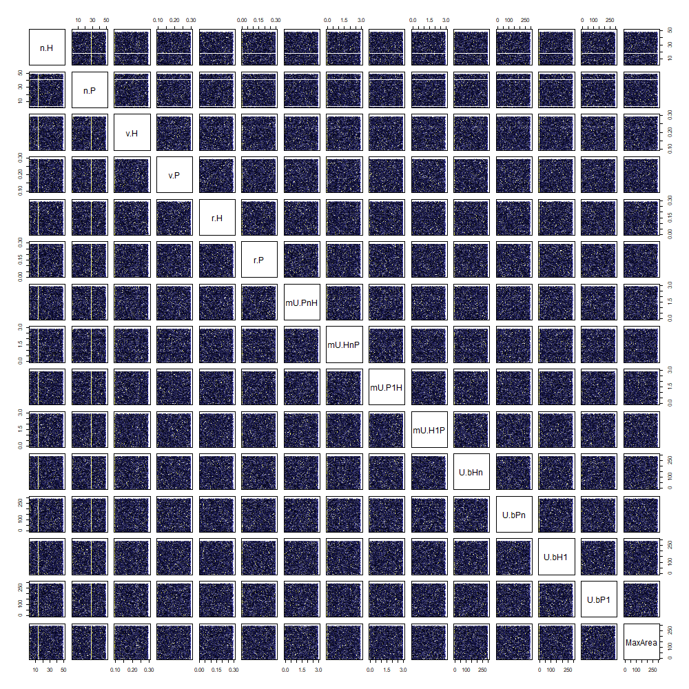

# Multiple parameter exploration

```{r 5_setup, include=FALSE}
# this chunk is needed in case you want to compile a separated html/pdf for this exploration (without bookdown package)
knitr::opts_chunk$set(echo = FALSE, message = FALSE, # hide code and messages
                      cache=TRUE, autodep=TRUE) 

source("library/hpcModel.run.R")
source("library/hpcModel.exploration.R")
source("library/hpcModel.plot.R")
# for ggplot:
require(reshape2)
require(ggplot2)
require(scales)

```

```{r 5_table-functions}
# this chunk is specific for this exploration 
# (table functions here are different from previous explorations)
run.table <- function(run.result)
{
  run.parnames <- names(run.result$PARS)
  run.parvalues <- c()
  for (i in 1:length(run.result$PARS))
  {
    run.parvalues <- c(run.parvalues, run.result$PARS[[i]])
  }
  knitr::kable(cbind(run.parnames, run.parvalues), col.names = c("parameter", "values"))
}

exp.table <- function(exp.results, numberOfParameters = 17)
{
  exp.parnames <- c()
  exp.values <- c()
  for (i in 1:numberOfParameters)
  {
    exp.parnames <- c(exp.parnames, names(exp.results)[i])
    value <- levels(factor(exp.results[[i]]))
    if (length(value) > 1) 
    {
      value <- as.numeric(as.character(value))
      value <- paste(min(value), "-", max(value), "(sample =", length(value), ")")
    }
    exp.values <- c(exp.values, value)
  }
  knitr::kable(cbind(exp.parnames, exp.values), col.names = c("parameter", "value"))
}
```

```{r 5_default-values}
# this is the 'default' parameter setting (end state is 'fast coevolution'):
# initial populations
iniH.default = 10
iniP.default = 10
# number of discrete types
n.H.default = 30
n.P.default = 30    
# undirected variation 
v.H.default = 0.15
v.P.default = 0.15
# intrinsic growth rate 
r.H.default = 0.04
r.P.default = 0.1
# Utility per capita of individuals of type N
mU.PnH.default = 1.5
mU.HnP.default = 1
# Utility per capita of individuals of type 1
mU.P1H.default = 0.15                           
mU.H1P.default = 0                               
# basic resources:
# population of type N that can be sustained by resources independent of HP relationship
U.bHn.default = 10                               
U.bPn.default = 20
# population of type 1 that can be sustained by resources independent of HP relationship
U.bH1.default = 80                               
U.bP1.default = 100                                 
# maximum local area to be used by populations (multiplier or scaling effect)
MaxArea.default = 200
# settings 
# simulation flow & data
maxIt.default = 5000
tol.default = 6
timing.threshold.default = 0.5
saveTrajectories.default = TRUE
messages.default = TRUE
```

```{r 5_setup_plus, include=FALSE}
require(DoE.wrapper)    # LHC
require(randomForest)   # RF
require(party)          # classification / regression tree
require(parallel)       # use parallelization, it takes 8 min aprox

outputVariables <- list()

run.LHC.experiment <- function(experimentSettings, cluster)
{
  parLapply(cluster, 1:nrow(experimentSettings),
            function(experimentIndex) {
              RESULTS <- hpcModel.run(
                iniH = iniH.default,
                iniP = iniP.default,
                n.H = experimentSettings[experimentIndex, 1],         
                n.P = experimentSettings[experimentIndex, 2],        
                v.H = experimentSettings[experimentIndex, 3],
                v.P = experimentSettings[experimentIndex, 4],
                r.H = r.H.default, 
                r.P = r.P.default, 
                mU.PnH = experimentSettings[experimentIndex, 5],
                mU.HnP = experimentSettings[experimentIndex, 6],
                mU.P1H = experimentSettings[experimentIndex, 7],                                  
                mU.H1P = experimentSettings[experimentIndex, 8],                                   
                U.bHn = experimentSettings[experimentIndex, 9],                                
                U.bPn = experimentSettings[experimentIndex, 10], 
                U.bH1 = experimentSettings[experimentIndex, 11],                               
                U.bP1 = experimentSettings[experimentIndex, 12],
                MaxArea = MaxArea.default,
                maxIt = 5000,
                tol = 6,
                saveTrajectories = FALSE,
                messages = FALSE
              )
              return(as.data.frame(RESULTS$END))
            })
}

```

```{r 5_plot-functions, include=FALSE}
# this chunk is specific for this exploration
collapsed.ggplot <- function(results,
                             parameterName,
                             variableName1,
                             variableName2,
                             ylab = 'observation variable',
                             plotScale = 1)
{
  ggplot(results, aes_string(x = parameterName)) +
    stat_smooth(
      aes_string(y = variableName1, colour = '"Humans"'),
      alpha = 0.5,
      level = 0.9999999
    ) +
    geom_point(aes_string(y = variableName1, colour = '"Humans"'), size = 0.05) +
    stat_smooth(
      aes_string(y = variableName2, colour = '"Plants"'),
      alpha = 0.5,
      level = 0.9999999
    ) +
    geom_point(aes_string(y = variableName2, colour = '"Plants"'), size = 0.05) +
    scale_colour_manual(name = '', values = c('Humans' = 'blue', 'Plants' = 'red')) +
    labs(x = parameterName,
         y = ylab) +
    theme_bw() +
    theme(
      axis.title = element_text(size = plotScale * 3),
      axis.text = element_text(size = plotScale * 1.5),
      legend.title = element_text(size = plotScale * 3.5),
      legend.text = element_text(size = plotScale * 2)
    )
}

parameter.x.scenario.ggplot <- function(results,
                                        parameterNames,
                                        variableName1,
                                        variableName2,
                                        scenarioSplitter,
                                        ylab = 'observation variable',
                                        plotScale = 1)
{
  temp <- cbind(results, scenarioSplitter)
  temp <- melt(temp[, c(variableName1, 
                        variableName2, 
                        names(temp)[ncol(temp)], 
                        parameterNames)], 
               id.vars = 1:3)
  names(temp) <-
  c("obsVar1", "obsVar2", "scenario", "parameter", "parValue")
  
  ggplot(temp) +
  geom_point(
    data = temp,
    aes(x = parValue, y = obsVar1, color = 'Humans'),
    alpha = 0.5, size = 1
  ) +
  geom_smooth(
    data = temp,
    aes(x = parValue, y = obsVar1), color = 'darkblue'
  ) +
  geom_point(
    data = temp,
    aes(x = parValue, y = obsVar2, color = 'Plants'),
    alpha = 0.5, size = 1
  ) +
  geom_smooth(
    data = temp,
    aes(x = parValue, y = obsVar2), color = 'darkred'
  ) +  
  facet_grid(
    scenario ~ parameter,
    scales = "free_x",
    labeller = label_parsed
  ) +
  scale_color_manual(name = '', values = c('Humans' = 'blue', 'Plants' = 'red')) +
  guides(color = guide_legend(override.aes = list(size = plotScale))) +
  labs(x = 'parameters values',
       y = ylab) +
  theme_bw() +
  theme(
      strip.background = element_rect(fill = NA, colour = NA), 
      strip.text.x = element_text(size = plotScale * 3),
      strip.text.y = element_text(size = plotScale * 2),
      panel.grid.minor =  element_blank(),
      panel.background = element_blank(),
      axis.title = element_text(size = plotScale * 3),
      axis.text = element_text(size = plotScale * 1.5),
      legend.title = element_text(size = plotScale * 3.5),
      legend.text = element_text(size = plotScale * 2)
      )
}

varImpPlot2 <- function(rf, cex = 1)
{
  imp <- importance(rf)
  imp <- imp[nrow(imp):1, ] # invert row order for plotting top-downwards
  
  # assuming order to be: n & v, mU, and U.b
  parColors <- c(rep("blue", 4), rep("green", 4), rep("red", 4))
  dotchart(imp, 
           color = parColors,
           cex = cex,
           main = rf$terms[[2]],
           pch = 19)
}
```

\newpage

## Sampling parameter values with Latin Hypercube Sampling (LHC)

```{r 5_LHC-values}
LHC.parameter.names <- c(
  'n.H', 'n.P',        
  'v.H', 'v.P',
  'mU.PnH', 'mU.HnP', 'mU.P1H', 'mU.H1P',                                   
  'U.bHn', 'U.bPn', 'U.bH1', 'U.bP1'
)
LHC.parameter.ranges <- list(
  n.H = c(3, 50),         
  n.P = c(3, 50),        
  v.H = c(0.1, 0.3),
  v.P = c(0.1, 0.3),
  mU.PnH = c(0, 3),
  mU.HnP = c(0, 3),
  mU.P1H = c(0, 3),                                  
  mU.H1P = c(0, 3),                                   
  U.bHn = c(0, 300),                                
  U.bPn = c(0, 300), 
  U.bH1 = c(0, 300),                               
  U.bP1 = c(0, 300)
)
```

**_Ranges of parameter exploration_**

**parameter**       | **value**
 ------------------ | ----------------------------------
 `n.H`, `n.P`       | [`r LHC.parameter.ranges$n.H[1]`, `r LHC.parameter.ranges$n.H[2]`], [`r LHC.parameter.ranges$n.P[1]`, `r LHC.parameter.ranges$n.P[2]`]
 `v.H`, `v.P`       | [`r LHC.parameter.ranges$v.H[1]`, `r LHC.parameter.ranges$v.H[2]`], [`r LHC.parameter.ranges$v.P[1]`, `r LHC.parameter.ranges$v.P[2]`]
 `mU.PnH`, `mU.HnP` | [`r LHC.parameter.ranges$mU.PnH[1]`, `r LHC.parameter.ranges$mU.PnH[2]`], [`r LHC.parameter.ranges$mU.HnP[1]`, `r LHC.parameter.ranges$mU.HnP[2]`]
 `mU.P1H`, `mU.H1P` | [`r LHC.parameter.ranges$mU.P1H[1]`, `r LHC.parameter.ranges$mU.P1H[2]`], [`r LHC.parameter.ranges$mU.H1P[1]`, `r LHC.parameter.ranges$mU.H1P[2]`]
 `U.bH1`, `U.bP1`   | [`r LHC.parameter.ranges$U.bH1[1]`, `r LHC.parameter.ranges$U.bH1[2]`], [`r LHC.parameter.ranges$U.bP1[1]`, `r LHC.parameter.ranges$U.bP1[2]`]
 `U.bHn`, `U.bPn`   | [`r LHC.parameter.ranges$U.bHn[1]`, `r LHC.parameter.ranges$U.bHn[2]`], [`r LHC.parameter.ranges$U.bPn[1]`, `r LHC.parameter.ranges$U.bPn[2]`]

```{r 5_LHC, include=FALSE}
### generate LHS design (strauss method, with 0.2 radious interaction)
# it takes 45 min aprox
if (!file.exists('LHS.RData')) # you must delete "LHC.RData" to create a new file
{
  LHS <- DoE.wrapper::lhs.design(
    nruns = 10000, # probably should be greater
    nfactors = 12,
    type = 'strauss',
    seed = 777,
    factor.names = LHC.parameter.ranges,
    digits = c(0, 0, 5, 5, 4, 4, 4, 4, 4, 4, 4, 4),
    RND = 0.2
  )

  # save
  save(LHS, file = 'LHS.RData')
}
```

```{r 5_LHC-load, include=FALSE}
# load
load('LHS.RData')

# build PARS
PARS <- as.data.frame(LHS)
```

**_ACTUAL parameter values_**

```{r 5_LHC-table, cache=TRUE, dependson=c('5_table-functions','5_LHC-load')}
exp.table(PARS, numberOfParameters = 12)
```

\newpage

```{r 5_LHC-pairs-plot, cache=TRUE, dependson='5_LHC-load'}
plotScale = 10

png("plots/5_multiplePar-LHC_pairs-plot.png",
    width = 100 * plotScale, height = 100 * plotScale)
pairs(LHS, pch='·')
invisible(dev.off())
```

```{r 5_LHC-pairs-plot-print, dependson='5_LHC-pairs-plot', out.width = '100%'}

```

\newpage

## Experiment overview

```{r 5_run-experiments, include=FALSE}
### run the model for every setting according to the LHS design
# it takes hours
if(!file.exists('exp.LHC.RData')) # you must delete "exp.LHC.RData" to create a new file
{
  
  # build cluster
  cl <- makeCluster(6)
  clusterExport(cl, 
                list('hpcModel.run', 'Fitness', 'coevo.coef', 
                     'PARS', 
                     'iniH.default', 'iniP.default', 
                     'r.H.default', 'r.P.default', 
                     'MaxArea.default'), 
                envir = environment())
  
  # loop
  exp.LHC <- run.LHC.experiment(PARS, cl)
  
  # stop cluster and clean
  stopCluster(cl)
  rm(cl)
  gc()
  
  # bind result
  exp.LHC <- do.call('rbind', exp.LHC)
  
  # build object
  exp.LHC <- cbind(PARS, exp.LHC)
  
  # save
  save(exp.LHC, file = 'exp.LHC.RData')
}
```

```{r 5_run-experiments-load, include=FALSE, dependson='5_run-experiments'}
# load
load('exp.LHC.RData')
```

```{r 5_overview-collapsed-plot, include=FALSE, cache=TRUE}
overview.variable.name = 'coevo'
plotScale = 10

#svg('plots/5_collapsed.svg', width=10, height=10)
png(paste0("plots/5_multiplePar-", overview.variable.name, "_collapsed-ggplot.png"),
    width = 100 * plotScale, height = 100 * plotScale)
collapsed.ggplot(exp.LHC,
                 'mU.HnP', 'coevo.H', 'coevo.P',
                 ylab = "coevolution coefficient",
                 plotScale = plotScale)
dev.off()
```

```{r 5_overview-collapsed-plot-print, dependson='5_overview-collapsed-plot', out.width = '100%'}
knitr::include_graphics(paste0("plots/5_multiplePar-", overview.variable.name, "_collapsed-ggplot.png"))
```

\newpage

### Random forest

**_Coevolution coefficients_**

```{r 5_rf-coevo.H, include=FALSE, cache=TRUE, dependson='5_setup_plus'}
RF.coevo.H <-
  randomForest::randomForest(
    coevo.H ~ n.H + n.P + v.H + v.P + mU.HnP + mU.H1P + mU.PnH + mU.P1H + U.bP1 + U.bPn + U.bH1 + U.bHn,
    data = exp.LHC,
    mtry = 5,
    ntree = 1000,
    importance = T
  )
acc.coevo.H <- mean((predict(RF.coevo.H, exp.LHC[, 1:12]) - exp.LHC$coevo.H) ^ 2)
#importance(RF.coevo.H)
```

```{r 5_rf-coevo.P, include=FALSE, cache=TRUE, dependson='5_setup_plus'}
RF.coevo.P <-
  randomForest::randomForest(
    coevo.P ~ n.H + n.P + v.H + v.P + mU.HnP + mU.H1P + mU.PnH + mU.P1H + U.bP1 + U.bPn + U.bH1 + U.bHn,
    data = exp.LHC,
    mtry = 5,
    ntree = 1000,
    importance = T
  )
acc.coevo.P <- mean((predict(RF.coevo.P, exp.LHC[, 1:12]) - exp.LHC$coevo.P) ^ 2)
#importance(RF.coevo.P)
```

```{r 5_rf-coevo-plots, include=FALSE, cache=TRUE}
plotScale = 2

png("plots/5_multiplePar-rf-coevo.png", width = 640 * plotScale, height = 320 * plotScale)
par(mar = c(3,1,3,1), cex.lab = plotScale * 0.5)
layout(matrix(c(1,2), ncol = 2))
varImpPlot2(RF.coevo.H, cex = plotScale * 0.8)
varImpPlot2(RF.coevo.P, cex = plotScale * 0.8)
dev.off()
```

```{r 5_rf-coevo-plot-print, dependson='5_rf-coevo-plots', out.width = '100%'}
knitr::include_graphics(paste0("plots/5_multiplePar-rf-coevo.png"))
```

\newpage

**_Dependency coefficients_**

```{r 5_rf-depend.H, include=FALSE, cache=TRUE, dependson='5_setup_plus'}
RF.depend.H <-
  randomForest::randomForest(
    depend.H ~ n.H + n.P + v.H + v.P + mU.HnP + mU.H1P + mU.PnH + mU.P1H + U.bP1 + U.bPn + U.bH1 + U.bHn,
    data = exp.LHC,
    mtry = 5,
    ntree = 1000,
    importance = T
  )
acc.depend.H <- mean((predict(RF.depend.H, exp.LHC[, 1:12]) - exp.LHC$depend.H) ^ 2)
#importance(RF.depend.H)
```

```{r 5_rf-depend.P, include=FALSE, cache=TRUE, dependson='5_setup_plus'}
RF.depend.P <-
  randomForest::randomForest(
    depend.P ~ n.H + n.P + v.H + v.P + mU.HnP + mU.H1P + mU.PnH + mU.P1H + U.bP1 + U.bPn + U.bH1 + U.bHn,
    data = exp.LHC,
    mtry = 5,
    ntree = 1000,
    importance = T
  )
acc.depend.P <- mean((predict(RF.depend.P, exp.LHC[, 1:12]) - exp.LHC$depend.P) ^ 2)
#importance(RF.depend.P)
```

```{r 5_rf-depend-plots, include=FALSE, cache=TRUE}
plotScale = 2

png("plots/5_multiplePar-rf-depend.png", width = 640 * plotScale, height = 320 * plotScale)
par(mar = c(3,1,3,1), cex.lab = plotScale * 0.5)
layout(matrix(c(1,2), ncol = 2))
varImpPlot2(RF.depend.H, cex = plotScale * 0.8)
varImpPlot2(RF.depend.P, cex = plotScale * 0.8)
dev.off()
```

```{r 5_rf-depend.H-plot-print, dependson='5_rf-depend-plots', out.width = '100%'}
knitr::include_graphics(paste0("plots/5_multiplePar-rf-depend.png"))
```

**_Timings_**

```{r 5_rf-timing.H, include=FALSE, cache=TRUE, dependson='5_setup_plus'}
RF.timing.H <-
  randomForest::randomForest(
    timing.H ~ n.H + n.P + v.H + v.P + mU.HnP + mU.H1P + mU.PnH + mU.P1H + U.bP1 + U.bPn + U.bH1 + U.bHn,
    data = exp.LHC,
    mtry = 5,
    ntree = 1000,
    importance = T
  )
acc.timing.H <- mean((predict(RF.timing.H, exp.LHC[, 1:12]) - exp.LHC$timing.H) ^ 2)
#importance(RF.timing.H)
```

```{r 5_rf-timing.P, include=FALSE, cache=TRUE, dependson='5_setup_plus'}
RF.timing.P <-
  randomForest::randomForest(
    timing.P ~ n.H + n.P + v.H + v.P + mU.HnP + mU.H1P + mU.PnH + mU.P1H + U.bP1 + U.bPn + U.bH1 + U.bHn,
    data = exp.LHC,
    mtry = 5,
    ntree = 1000,
    importance = T
  )
acc.timing.P <- mean((predict(RF.timing.P, exp.LHC[, 1:12]) - exp.LHC$timing.P) ^ 2)
#importance(RF.timing.P)
```

```{r 5_rf-timing-plots, include=FALSE, cache=TRUE}
plotScale = 2

png("plots/5_multiplePar-rf-timing.png", width = 640 * plotScale, height = 320 * plotScale)
par(mar = c(3,1,3,1), cex.lab = plotScale * 0.5)
layout(matrix(c(1,2), ncol = 2))
varImpPlot2(RF.timing.H, cex = plotScale * 0.8)
varImpPlot2(RF.timing.P, cex = plotScale * 0.8)
dev.off()
```

```{r 5_rf-timing.H-plot-print, dependson='5_rf-timing-plots', out.width = '100%'}
knitr::include_graphics(paste0("plots/5_multiplePar-rf-timing.png"))
```

\newpage

## Scenarios

```{r 5_split-scenarios, include=FALSE, cache=TRUE, dependson='5_run-experiments-load'}
# exp.LHC.scenarios.names <- c(
#   'plantImprove', 'humanImprove', 'bothImprove',
#   'plantLessBase', 'humanLessBase', 'bothLessBase'
# )

# # mU.PnH > mU.P1H (mutualistic plant types give more utility = TRUE, else = FALSE)
exp.LHC_plantImprove <- factor(as.character(exp.LHC$mU.PnH > exp.LHC$mU.P1H),
                               levels = c('TRUE', 'FALSE'),
                               labels = c('mU.PnH > mU.P1H', 
                                          'mU.PnH <= mU.P1H')
                               )

# # mU.HnP > mU.H1P (mutualistic human types give more utility = TRUE, else = FALSE)
exp.LHC_humanImprove <- factor(as.character(exp.LHC$mU.HnP > exp.LHC$mU.H1P),
                               levels = c('TRUE', 'FALSE'),
                               labels = c('mU.HnP > mU.H1P',
                                          'mU.HnP <= mU.H1P'))

# # mU.PnH > mU.P1H AND mU.HnP > mU.H1P (mutualistic types give more utility = TRUE, else = FALSE)
exp.LHC_bothImprove <- factor(as.character(exp.LHC$mU.PnH > exp.LHC$mU.P1H & exp.LHC$mU.HnP > exp.LHC$mU.H1P),
                              levels = c('TRUE', 'FALSE'),
                              labels = c('mU.PnH > mU.P1H ~~~ AND ~~~ mU.HnP > mU.H1P', 
                                         'mU.PnH <= mU.P1H ~~~ AND ~~~ mU.HnP <= mU.H1P'))

# # U.bP1 > U.bPn (non-mutualistic plant types obtain more utility from other resources = TRUE, else = FALSE)
exp.LHC_plantLessBase <- factor(as.character(exp.LHC$U.bP1 > exp.LHC$U.bPn),
                                levels = c('TRUE', 'FALSE'),
                                labels = c('U.bP1 > U.bPn',
                                           'U.bP1 <= U.bPn'))

# # U.bH1 > U.bHn (non-mutualistic human types obtain more utility from other resources = TRUE, else = FALSE)
exp.LHC_humanLessBase <- factor(as.character(exp.LHC$U.bH1 > exp.LHC$U.bHn),
                                levels = c('TRUE', 'FALSE'),
                                labels = c('U.bH1 > U.bHn',
                                           'U.bH1 <= U.bHn'))

# # mU.PnH > mU.P1H AND mU.HnP > mU.H1P (non-mutualistic types obtain more utility from other resources = TRUE, else = FALSE)
exp.LHC_bothLessBase <- factor(as.character(exp.LHC$U.bP1 > exp.LHC$U.bPn & exp.LHC$U.bH1 > exp.LHC$U.bHn),
                               levels = c('TRUE', 'FALSE'),
                               labels = c('mU.PnH > mU.P1H ~~~ AND ~~~ mU.HnP > mU.H1P',
                                          'mU.PnH <= mU.P1H ~~~ AND ~~~ mU.HnP <= mU.H1P'))
```

### Mutualistic human type gives more utility ($\bar{U}_{H_{n}P}> \bar{U}_{H_{1}P}$)

**_Coevolution coefficients_**

```{r 5_scenarios-humanImprove-coevo-plots, include=FALSE, cache=TRUE, dependson=c('5_run-experiments', '5_run-experiments-load', '5_split-scenarios')}

plotScale = 10

#svg('plots/5_collapsed.svg', width=10, height=10)
png("plots/5_multiplePar-coevo-humanImprove-ggplot.png",
    width = 200 * plotScale,
    height = 100 * plotScale
)
parameter.x.scenario.ggplot(exp.LHC, 
                            LHC.parameter.names,
                            'coevo.H', 'coevo.P',
                            scenarioSplitter = exp.LHC_humanImprove,
                            ylab = "coevolution coefficient",
                            plotScale = plotScale)
dev.off()
```

```{r 5_scenarios-humanImprove-coevo-plot-print, dependson='5_scenarios-humanImprove-coevo-plot', out.width = '100%'}
knitr::include_graphics("plots/5_multiplePar-coevo-humanImprove-ggplot.png")
```

**_Dependency coefficients_**

```{r 5_scenarios-humanImprove-depend-plots, include=FALSE, cache=TRUE, dependson=c('5_run-experiments', '5_run-experiments-load', '5_split-scenarios')}

plotScale = 10

#svg('plots/5_collapsed.svg', width=10, height=10)
png("plots/5_multiplePar-depend-humanImprove-ggplot.png",
    width = 200 * plotScale,
    height = 100 * plotScale
)
parameter.x.scenario.ggplot(exp.LHC, 
                            LHC.parameter.names,
                            'depend.H', 'depend.P',
                            scenarioSplitter = exp.LHC_humanImprove,
                            ylab = "dependency coefficient",
                            plotScale = plotScale)
dev.off()
```

```{r 5_scenarios-humanImprove-depend-plot-print, dependson='5_scenarios-humanImprove-depend-plot', out.width = '100%'}
knitr::include_graphics("plots/5_multiplePar-depend-humanImprove-ggplot.png")
```

**_Timings_**

```{r 5_scenarios-humanImprove-timing-plots, include=FALSE, cache=TRUE, dependson=c('5_run-experiments', '5_run-experiments-load', '5_split-scenarios')}

plotScale = 10

#svg('plots/5_collapsed.svg', width=10, height=10)
png("plots/5_multiplePar-timing-humanImprove-ggplot.png",
    width = 200 * plotScale,
    height = 100 * plotScale
)
parameter.x.scenario.ggplot(exp.LHC, 
                            LHC.parameter.names,
                            'timing.H', 'timing.P',
                            scenarioSplitter = exp.LHC_humanImprove,
                            ylab = "Timing",
                            plotScale = plotScale)
dev.off()
```

```{r 5_scenarios-humanImprove-timing-plot-print, timingson='5_scenarios-humanImprove-timing-plot', out.width = '100%'}
knitr::include_graphics("plots/5_multiplePar-timing-humanImprove-ggplot.png")
```

\newpage

### Mutualistic plant type gives more utility ($\bar{U}_{P_{n}H}> \bar{U}_{P_{1}H}$)

**_Coevolution coefficients_**

```{r 5_scenarios-plantImprove-coevo-plots, include=FALSE, cache=TRUE, dependson=c('5_run-experiments', '5_run-experiments-load', '5_split-scenarios')}

plotScale = 10

#svg('plots/5_collapsed.svg', width=10, height=10)
png("plots/5_multiplePar-coevo-plantImprove-ggplot.png",
    width = 200 * plotScale,
    height = 100 * plotScale
)
parameter.x.scenario.ggplot(exp.LHC, 
                            LHC.parameter.names,
                            'coevo.H', 'coevo.P',
                            scenarioSplitter = exp.LHC_plantImprove,
                            ylab = "coevolution coefficient",
                            plotScale = plotScale)
dev.off()
```

```{r 5_scenarios-plantImprove-coevo-plot-print, dependson='5_scenarios-plantImprove-coevo-plot', out.width = '100%'}
knitr::include_graphics("plots/5_multiplePar-coevo-plantImprove-ggplot.png")
```

**_Dependency coefficients_**

```{r 5_scenarios-plantImprove-depend-plots, include=FALSE, cache=TRUE, dependson=c('5_run-experiments', '5_run-experiments-load', '5_split-scenarios')}

plotScale = 10

#svg('plots/5_collapsed.svg', width=10, height=10)
png("plots/5_multiplePar-depend-plantImprove-ggplot.png",
    width = 200 * plotScale,
    height = 100 * plotScale
)
parameter.x.scenario.ggplot(exp.LHC, 
                            LHC.parameter.names,
                            'depend.H', 'depend.P',
                            scenarioSplitter = exp.LHC_plantImprove,
                            ylab = "dependency coefficient",
                            plotScale = plotScale)
dev.off()
```

```{r 5_scenarios-plantImprove-depend-plot-print, dependson='5_scenarios-plantImprove-depend-plot', out.width = '100%'}
knitr::include_graphics("plots/5_multiplePar-depend-plantImprove-ggplot.png")
```

**_Timings_**

```{r 5_scenarios-plantImprove-timing-plots, include=FALSE, cache=TRUE, dependson=c('5_run-experiments', '5_run-experiments-load', '5_split-scenarios')}

plotScale = 10

#svg('plots/5_collapsed.svg', width=10, height=10)
png("plots/5_multiplePar-timing-plantImprove-ggplot.png",
    width = 200 * plotScale,
    height = 100 * plotScale
)
parameter.x.scenario.ggplot(exp.LHC, 
                            LHC.parameter.names,
                            'timing.H', 'timing.P',
                            scenarioSplitter = exp.LHC_plantImprove,
                            ylab = "Timing",
                            plotScale = plotScale)
dev.off()
```

```{r 5_scenarios-plantImprove-timing-plot-print, timingson='5_scenarios-plantImprove-timing-plot', out.width = '100%'}
knitr::include_graphics("plots/5_multiplePar-timing-plantImprove-ggplot.png")
```

\newpage

### Mutualistic types (human and plant) give more utility ($\bar{U}_{H_{n}P}> \bar{U}_{H_{1}P}$ AND $\bar{U}_{P_{n}H}> \bar{U}_{P_{1}H}$)

**_Coevolution coefficients_**

```{r 5_scenarios-bothImprove-coevo-plots, include=FALSE, cache=TRUE, dependson=c('5_run-experiments', '5_run-experiments-load', '5_split-scenarios')}

plotScale = 10

#svg('plots/5_collapsed.svg', width=10, height=10)
png("plots/5_multiplePar-coevo-bothImprove-ggplot.png",
    width = 200 * plotScale,
    height = 100 * plotScale
)
parameter.x.scenario.ggplot(exp.LHC, 
                            LHC.parameter.names,
                            'coevo.H', 'coevo.P',
                            scenarioSplitter = exp.LHC_bothImprove,
                            ylab = "coevolution coefficient",
                            plotScale = plotScale)
dev.off()
```

```{r 5_scenarios-bothImprove-coevo-plot-print, dependson='5_scenarios-bothImprove-coevo-plot', out.width = '100%'}
knitr::include_graphics("plots/5_multiplePar-coevo-bothImprove-ggplot.png")
```

**_Dependency coefficients_**

```{r 5_scenarios-bothImprove-depend-plots, include=FALSE, cache=TRUE, dependson=c('5_run-experiments', '5_run-experiments-load', '5_split-scenarios')}

plotScale = 10

#svg('plots/5_collapsed.svg', width=10, height=10)
png("plots/5_multiplePar-depend-bothImprove-ggplot.png",
    width = 200 * plotScale,
    height = 100 * plotScale
)
parameter.x.scenario.ggplot(exp.LHC, 
                            LHC.parameter.names,
                            'depend.H', 'depend.P',
                            scenarioSplitter = exp.LHC_bothImprove,
                            ylab = "dependency coefficient",
                            plotScale = plotScale)
dev.off()
```

```{r 5_scenarios-bothImprove-depend-plot-print, dependson='5_scenarios-bothImprove-depend-plot', out.width = '100%'}
knitr::include_graphics("plots/5_multiplePar-depend-bothImprove-ggplot.png")
```

**_Timings_**

```{r 5_scenarios-bothImprove-timing-plots, include=FALSE, cache=TRUE, dependson=c('5_run-experiments', '5_run-experiments-load', '5_split-scenarios')}

plotScale = 10

#svg('plots/5_collapsed.svg', width=10, height=10)
png("plots/5_multiplePar-timing-bothImprove-ggplot.png",
    width = 200 * plotScale,
    height = 100 * plotScale
)
parameter.x.scenario.ggplot(exp.LHC, 
                            LHC.parameter.names,
                            'timing.H', 'timing.P',
                            scenarioSplitter = exp.LHC_bothImprove,
                            ylab = "Timing",
                            plotScale = plotScale)
dev.off()
```

```{r 5_scenarios-bothImprove-timing-plot-print, timingson='5_scenarios-bothImprove-timing-plot', out.width = '100%'}
knitr::include_graphics("plots/5_multiplePar-timing-bothImprove-ggplot.png")
```

\newpage

### Mutualistic human type gets less utility from other resources ($U_{bH_{1}}>U_{bH_{n}}$)

**_Coevolution coefficients_**

```{r 5_scenarios-humanLessBase-coevo-plots, include=FALSE, cache=TRUE, dependson=c('5_run-experiments', '5_run-experiments-load', '5_split-scenarios')}

plotScale = 10

#svg('plots/5_collapsed.svg', width=10, height=10)
png("plots/5_multiplePar-coevo-humanLessBase-ggplot.png",
    width = 200 * plotScale,
    height = 100 * plotScale
)
parameter.x.scenario.ggplot(exp.LHC, 
                            LHC.parameter.names,
                            'coevo.H', 'coevo.P',
                            scenarioSplitter = exp.LHC_humanLessBase,
                            ylab = "coevolution coefficient",
                            plotScale = plotScale)
dev.off()
```

```{r 5_scenarios-humanLessBase-coevo-plot-print, dependson='5_scenarios-humanLessBase-coevo-plot', out.width = '100%'}
knitr::include_graphics("plots/5_multiplePar-coevo-humanLessBase-ggplot.png")
```

**_Dependency coefficients_**

```{r 5_scenarios-humanLessBase-depend-plots, include=FALSE, cache=TRUE, dependson=c('5_run-experiments', '5_run-experiments-load', '5_split-scenarios')}

plotScale = 10

#svg('plots/5_collapsed.svg', width=10, height=10)
png("plots/5_multiplePar-depend-humanLessBase-ggplot.png",
    width = 200 * plotScale,
    height = 100 * plotScale
)
parameter.x.scenario.ggplot(exp.LHC, 
                            LHC.parameter.names,
                            'depend.H', 'depend.P',
                            scenarioSplitter = exp.LHC_humanLessBase,
                            ylab = "dependency coefficient",
                            plotScale = plotScale)
dev.off()
```

```{r 5_scenarios-humanLessBase-depend-plot-print, dependson='5_scenarios-humanLessBase-depend-plot', out.width = '100%'}
knitr::include_graphics("plots/5_multiplePar-depend-humanLessBase-ggplot.png")
```

**_Timings_**

```{r 5_scenarios-humanLessBase-timing-plots, include=FALSE, cache=TRUE, dependson=c('5_run-experiments', '5_run-experiments-load', '5_split-scenarios')}

plotScale = 10

#svg('plots/5_collapsed.svg', width=10, height=10)
png("plots/5_multiplePar-timing-humanLessBase-ggplot.png",
    width = 200 * plotScale,
    height = 100 * plotScale
)
parameter.x.scenario.ggplot(exp.LHC, 
                            LHC.parameter.names,
                            'timing.H', 'timing.P',
                            scenarioSplitter = exp.LHC_humanLessBase,
                            ylab = "Timing",
                            plotScale = plotScale)
dev.off()
```

```{r 5_scenarios-humanLessBase-timing-plot-print, timingson='5_scenarios-humanLessBase-timing-plot', out.width = '100%'}
knitr::include_graphics("plots/5_multiplePar-timing-humanLessBase-ggplot.png")
```

\newpage

### Mutualistic plant type gets less utility from other resources ($U_{bP_{1}}>U_{bP_{n}}$)

**_Coevolution coefficients_**

```{r 5_scenarios-plantLessBase-coevo-plots, include=FALSE, cache=TRUE, dependson=c('5_run-experiments', '5_run-experiments-load', '5_split-scenarios')}

plotScale = 10

#svg('plots/5_collapsed.svg', width=10, height=10)
png("plots/5_multiplePar-coevo-plantLessBase-ggplot.png",
    width = 200 * plotScale,
    height = 100 * plotScale
)
parameter.x.scenario.ggplot(exp.LHC, 
                            LHC.parameter.names,
                            'coevo.H', 'coevo.P',
                            scenarioSplitter = exp.LHC_plantLessBase,
                            ylab = "coevolution coefficient",
                            plotScale = plotScale)
dev.off()
```

```{r 5_scenarios-plantLessBase-coevo-plot-print, dependson='5_scenarios-plantLessBase-coevo-plot', out.width = '100%'}
knitr::include_graphics("plots/5_multiplePar-coevo-plantLessBase-ggplot.png")
```

**_Dependency coefficients_**

```{r 5_scenarios-plantLessBase-depend-plots, include=FALSE, cache=TRUE, dependson=c('5_run-experiments', '5_run-experiments-load', '5_split-scenarios')}

plotScale = 10

#svg('plots/5_collapsed.svg', width=10, height=10)
png("plots/5_multiplePar-depend-plantLessBase-ggplot.png",
    width = 200 * plotScale,
    height = 100 * plotScale
)
parameter.x.scenario.ggplot(exp.LHC, 
                            LHC.parameter.names,
                            'depend.H', 'depend.P',
                            scenarioSplitter = exp.LHC_plantLessBase,
                            ylab = "dependency coefficient",
                            plotScale = plotScale)
dev.off()
```

```{r 5_scenarios-plantLessBase-depend-plot-print, dependson='5_scenarios-plantLessBase-depend-plot', out.width = '100%'}
knitr::include_graphics("plots/5_multiplePar-depend-plantLessBase-ggplot.png")
```

**_Timings_**

```{r 5_scenarios-plantLessBase-timing-plots, include=FALSE, cache=TRUE, dependson=c('5_run-experiments', '5_run-experiments-load', '5_split-scenarios')}

plotScale = 10

#svg('plots/5_collapsed.svg', width=10, height=10)
png("plots/5_multiplePar-timing-plantLessBase-ggplot.png",
    width = 200 * plotScale,
    height = 100 * plotScale
)
parameter.x.scenario.ggplot(exp.LHC, 
                            LHC.parameter.names,
                            'timing.H', 'timing.P',
                            scenarioSplitter = exp.LHC_plantLessBase,
                            ylab = "Timing",
                            plotScale = plotScale)
dev.off()
```

```{r 5_scenarios-plantLessBase-timing-plot-print, timingson='5_scenarios-plantLessBase-timing-plot', out.width = '100%'}
knitr::include_graphics("plots/5_multiplePar-timing-plantLessBase-ggplot.png")
```

\newpage

### Mutualistic types (human and plant) get less utility from other resources ($U_{bH_{1}}>U_{bH_{n}}$ AND $U_{bP_{1}}>U_{bP_{n}}$)

**_Coevolution coefficients_**

```{r 5_scenarios-bothLessBase-coevo-plots, include=FALSE, cache=TRUE, dependson=c('5_run-experiments', '5_run-experiments-load', '5_split-scenarios')}

plotScale = 10

#svg('plots/5_collapsed.svg', width=10, height=10)
png("plots/5_multiplePar-coevo-bothLessBase-ggplot.png",
    width = 200 * plotScale,
    height = 100 * plotScale
)
parameter.x.scenario.ggplot(exp.LHC, 
                            LHC.parameter.names,
                            'coevo.H', 'coevo.P',
                            scenarioSplitter = exp.LHC_bothLessBase,
                            ylab = "coevolution coefficient",
                            plotScale = plotScale)
dev.off()
```

```{r 5_scenarios-bothLessBase-coevo-plot-print, dependson='5_scenarios-bothLessBase-coevo-plot', out.width = '100%'}
knitr::include_graphics("plots/5_multiplePar-coevo-bothLessBase-ggplot.png")
```

**_Dependency coefficients_**

```{r 5_scenarios-bothLessBase-depend-plots, include=FALSE, cache=TRUE, dependson=c('5_run-experiments', '5_run-experiments-load', '5_split-scenarios')}

plotScale = 10

#svg('plots/5_collapsed.svg', width=10, height=10)
png("plots/5_multiplePar-depend-bothLessBase-ggplot.png",
    width = 200 * plotScale,
    height = 100 * plotScale
)
parameter.x.scenario.ggplot(exp.LHC, 
                            LHC.parameter.names,
                            'depend.H', 'depend.P',
                            scenarioSplitter = exp.LHC_bothLessBase,
                            ylab = "dependency coefficient",
                            plotScale = plotScale)
dev.off()
```

```{r 5_scenarios-bothLessBase-depend-plot-print, dependson='5_scenarios-bothLessBase-depend-plot', out.width = '100%'}
knitr::include_graphics("plots/5_multiplePar-depend-bothLessBase-ggplot.png")
```

**_Timings_**

```{r 5_scenarios-bothLessBase-timing-plots, include=FALSE, cache=TRUE, dependson=c('5_run-experiments', '5_run-experiments-load', '5_split-scenarios')}

plotScale = 10

#svg('plots/5_collapsed.svg', width=10, height=10)
png("plots/5_multiplePar-timing-bothLessBase-ggplot.png",
    width = 200 * plotScale,
    height = 100 * plotScale
)
parameter.x.scenario.ggplot(exp.LHC, 
                            LHC.parameter.names,
                            'timing.H', 'timing.P',
                            scenarioSplitter = exp.LHC_bothLessBase,
                            ylab = "Timing",
                            plotScale = plotScale)
dev.off()
```

```{r 5_scenarios-bothLessBase-timing-plot-print, timingson='5_scenarios-bothLessBase-timing-plot', out.width = '100%'}
knitr::include_graphics("plots/5_multiplePar-timing-bothLessBase-ggplot.png")
```

