# Multiple parameter exploration

```{r 5_setup, include=FALSE}
# this chunk is needed in case you want to compile a separated html/pdf for this exploration (without bookdown package)
knitr::opts_chunk$set(echo = FALSE, message = FALSE, # hide code and messages
                      cache=TRUE, autodep=TRUE) 

source("library/hpcModel.run.R")
source("library/hpcModel.exploration.R")
source("library/hpcModel.plot.R")
# for ggplot:
require(reshape2)
require(ggplot2)
require(scales)
require(ggpubr)
require(kableExtra)
```

```{r 5_table-functions}
# this chunk is specific for this exploration 
# (table functions here are different from previous explorations)
run.table <- function(run.result, caption = NULL, output = "html")
{
  run.parnames <- names(run.result$PARS)
  run.parvalues <- c()
  for (i in 1:length(run.result$PARS))
  {
    run.parvalues <- c(run.parvalues, run.result$PARS[[i]])
  }
  knitr::kable(cbind(run.parnames, run.parvalues), output,
               col.names = c("parameter", "values"),
               caption = caption) %>%
    kable_styling(latex_options = "hold_position")
}

exp.table <- function(exp.results, numberOfParameters = 17, caption = NULL, output = "html")
{
  exp.parnames <- c()
  exp.values <- c()
  for (i in 1:numberOfParameters)
  {
    exp.parnames <- c(exp.parnames, names(exp.results)[i])
    value <- levels(factor(exp.results[,i]))
    if (length(value) > 1) 
    {
      value <- as.numeric(as.character(value))
      value <- paste(min(value), "-", max(value), "(sample =", length(value), ")")
    }
    exp.values <- c(exp.values, value)
  }
  knitr::kable(cbind(exp.parnames, exp.values), output,
               col.names = c("parameter", "value"),
               caption = caption) %>%
    kable_styling(latex_options = "hold_position")
}
```

```{r 5_default-values}
# this is the 'default' parameter setting (end state is 'fast coevolution'):
# initial populations
iniH.default = 10
iniP.default = 10
# number of discrete types
n.H.default = 30
n.P.default = 30    
# undirected variation 
v.H.default = 0.15
v.P.default = 0.15
# intrinsic growth rate 
r.H.default = 0.04
r.P.default = 0.1
# Utility per capita of individuals of type N
mU.PnH.default = 1.5
mU.HnP.default = 1
# Utility per capita of individuals of type 1
mU.P1H.default = 0.15                           
mU.H1P.default = 0                               
# basic resources:
# population of type N that can be sustained by resources independent of HP relationship
U.bHn.default = 10                               
U.bPn.default = 20
# population of type 1 that can be sustained by resources independent of HP relationship
U.bH1.default = 80                               
U.bP1.default = 100                                 
# maximum local area to be used by populations (multiplier or scaling effect)
MaxArea.default = 200
# settings 
# simulation flow & data
maxIt.default = 5000
tol.default = 6
timing.threshold.default = 0.5
saveTrajectories.default = TRUE
messages.default = TRUE
```

```{r 5_setup_plus, include=FALSE}
require(DoE.wrapper)    # LHS
require(randomForest)   # RF
require(party)          # classification / regression tree
require(parallel)       # use parallelization, it takes 8 min aprox

run.LHS.experiment <- function(experimentSettings, cluster)
{
  parLapply(cluster, 1:nrow(experimentSettings),
            function(experimentIndex) {
              RESULTS <- hpcModel.run(
                iniH = iniH.default,
                iniP = iniP.default,
                n.H = experimentSettings[experimentIndex,     1],         
                n.P = experimentSettings[experimentIndex,     2],        
                v.H = experimentSettings[experimentIndex,     3],
                v.P = experimentSettings[experimentIndex,     4],
                r.H = experimentSettings[experimentIndex,     5], 
                r.P = experimentSettings[experimentIndex,     6], 
                mU.PnH = experimentSettings[experimentIndex,  7],
                mU.HnP = experimentSettings[experimentIndex,  8],
                mU.P1H = experimentSettings[experimentIndex,  9],
                mU.H1P = experimentSettings[experimentIndex,  10],
                U.bHn = experimentSettings[experimentIndex,   11],
                U.bPn = experimentSettings[experimentIndex,   12], 
                U.bH1 = experimentSettings[experimentIndex,   13],
                U.bP1 = experimentSettings[experimentIndex,   14],
                MaxArea = experimentSettings[experimentIndex, 15],
                maxIt = maxIt.default,
                tol = tol.default,
                saveTrajectories = FALSE,
                messages = FALSE
              )
              return(as.data.frame(RESULTS$END))
            })
}

run.LHS.experiment2 <- function(experimentSettings, cluster)
{
  parLapply(cluster, 1:nrow(experimentSettings),
            function(experimentIndex) {
              RESULTS <- hpcModel.run(
                iniH = iniH.default,
                iniP = iniP.default,
                n.H = experimentSettings[experimentIndex,     1],         
                n.P = experimentSettings[experimentIndex,     2],        
                v.H = experimentSettings[experimentIndex,     3],
                v.P = experimentSettings[experimentIndex,     4],
                r.H = experimentSettings[experimentIndex,     5], 
                r.P = experimentSettings[experimentIndex,     6], 
                mU.PnH = experimentSettings[experimentIndex,  7],
                mU.HnP = experimentSettings[experimentIndex,  8],
                mU.P1H = experimentSettings[experimentIndex,  9],
                mU.H1P = experimentSettings[experimentIndex,  10],
                U.bHn = experimentSettings[experimentIndex,   11],
                U.bPn = experimentSettings[experimentIndex,   12], 
                U.bH1 = experimentSettings[experimentIndex,   13],
                U.bP1 = experimentSettings[experimentIndex,   14],
                MaxArea = experimentSettings[experimentIndex, 15],
                maxIt = maxIt.default,
                tol = tol.default,
                saveTrajectories = TRUE,
                messages = FALSE
              )
              return(RESULTS$TRAJECTORIES)
            })
}
```

```{r 5_plot-functions, include=FALSE}
# this chunk is specific for this exploration
collapsed.ggplot <- function(results,
                             parameterName,
                             variableName1,
                             variableName2,
                             ylab = 'observation variable',
                             plotScale = 1)
{
  ggplot(results, aes_string(x = parameterName)) +
    stat_smooth(
      aes_string(y = variableName1, colour = '"Humans"'),
      alpha = 0.5,
      level = 0.9999999
    ) +
    geom_point(aes_string(y = variableName1, colour = '"Humans"'), size = 0.05) +
    stat_smooth(
      aes_string(y = variableName2, colour = '"Plants"'),
      alpha = 0.5,
      level = 0.9999999
    ) +
    geom_point(aes_string(y = variableName2, colour = '"Plants"'), size = 0.05) +
    scale_colour_manual(name = '', values = c('Humans' = 'blue', 'Plants' = 'red')) +
    labs(x = parameterName,
         y = ylab) +
    theme_bw() +
    theme(
      axis.title = element_text(size = plotScale * 3),
      axis.text = element_text(size = plotScale * 1.5),
      legend.title = element_text(size = plotScale * 3.5),
      legend.text = element_text(size = plotScale * 2)
    )
}

trajectories.ggplot <- function(runs,
                                variables.plot.1,
                                variables.plot.2,
                                variables.plot.1.title,
                                variables.plot.2.title,
                                cex = 1)
{
  g1.data <- reshape::melt(exp.LHS.trajectories[, c('run', 'time', variables.plot.1)], 
                           id.vars = c('run', 'time'))
  g1 <- 
    ggplot(data = g1.data, aes(x = time)) +
    geom_line(data = g1.data, aes(x = time, y = value, colour = variable)) +
    facet_wrap(.~factor(run), ncol = 5) +
    scale_color_manual(values = c('blue', 'red')) +
    theme_bw() +
    theme(strip.background = element_blank(), strip.text.x = element_blank(),
          legend.title = element_blank()) +
    ggtitle(variables.plot.1.title) +
    ylab('')
  
  g2.data <- reshape::melt(exp.LHS.trajectories[, c('run', 'time', variables.plot.2)], 
                           id.vars = c('run', 'time'))
  g2 <- 
    ggplot(data = g2.data, aes(x = time)) +
    geom_line(data = g2.data, aes(x = time, y = value, colour = variable)) +
    geom_hline(aes(yintercept = 0), data = g2.data, linetype = "dashed") +
    ylim(-1, 1) +
    facet_wrap(.~factor(run), ncol = 5) +
    scale_color_manual(values = c('blue', 'red')) +
    theme_bw() +
    theme(strip.background = element_blank(), strip.text.x = element_blank(),
          legend.title = element_blank()) +
    ggtitle(variables.plot.2.title) +
    ylab('')
  
  ggpubr::ggarrange(g1, g2, nrow = 2, legend = "bottom", common.legend = TRUE)
}

parameter.x.scenario.ggplot <- function(results,
                                        parameterNames,
                                        variableName1,
                                        variableName2,
                                        scenarioSplitter,
                                        ylab = 'observation variable',
                                        plotScale = 1,
                                        y.log = FALSE)
{
  temp <- cbind(results, scenarioSplitter)
  temp <- melt(temp[, c(variableName1, 
                        variableName2, 
                        names(temp)[ncol(temp)], 
                        parameterNames)], 
               id.vars = 1:3)
  names(temp) <-
  c("obsVar1", "obsVar2", "scenario", "parameter", "parValue")
  
  p <- ggplot(temp) +
  geom_point(
    data = temp,
    aes(x = parValue, y = obsVar1, color = 'Humans'),
    alpha = 0.2, size = 1
  ) +
  geom_smooth(
    data = temp,
    aes(x = parValue, y = obsVar1), color = 'darkblue'
  ) +
  geom_point(
    data = temp,
    aes(x = parValue, y = obsVar2, color = 'Plants'),
    alpha = 0.2, size = 1
  ) +
  geom_smooth(
    data = temp,
    aes(x = parValue, y = obsVar2), color = 'darkred'
  ) +  
  facet_grid(
    scenario ~ parameter,
    scales = "free_x",
    labeller = label_parsed
  ) +
  scale_color_manual(name = '', values = c('Humans' = 'blue', 'Plants' = 'red')) +
  guides(color = guide_legend(override.aes = list(size = plotScale))) +
  labs(x = 'parameters values',
       y = ylab) +
  theme_bw() +
  theme(
      strip.background = element_rect(fill = NA, colour = NA), 
      strip.text.x = element_text(size = plotScale * 3),
      strip.text.y = element_text(size = plotScale * 2),
      panel.grid.minor =  element_blank(),
      panel.background = element_blank(),
      axis.title = element_text(size = plotScale * 3),
      axis.text = element_text(size = plotScale * 1.5),
      legend.title = element_text(size = plotScale * 3.5),
      legend.text = element_text(size = plotScale * 2)
      )
  if (y.log) p <- p + scale_y_log10()
  p
}

varImpPlot2 <- function(RF, cex = 1)
{
  imp <- importance(RF)
  imp <- imp[nrow(imp):1, ] # invert row order for plotting top-downwards
  
  # set negative values as the minimum positive values
  imp[imp < 0] <- min(imp[imp > 0]) 
  # log 10 scale
  imp <- log(imp, 10)
  
  # assuming order to be: n, v, r, mU, U.b and MaxArea
  parColors <- c("black", rep("blue", 4), rep("green", 4), rep("red", 6))
  dotchart(imp, 
           color = parColors,
           cex = cex,
           main = RF$terms[[2]],
           pch = 19)
}

varImpPlot2Pair <- function(RF1, RF2, cex = 1)
{
  par(mar = c(3,1,3,1), cex.lab = cex * 0.5)
  layout(matrix(c(1,2,3,3), ncol = 2, byrow = T),
         heights = c(12,1))
  
  varImpPlot2(RF1, cex = cex * 0.8)
  varImpPlot2(RF2, cex = cex * 0.8)
  
  par(mar=c(0, 0, 0, 0))
  plot(c(0, 1), c(0, 1), ann = F, bty = 'n', type = 'n', xaxt = 'n', yaxt = 'n')
  text(x = 0.3, y = 0.8, expression(paste(log[10], x)), 
       cex = 1.6, col = "black", font = 4)
  text(x = 0.83, y = 0.8, expression(paste(log[10], x)), 
       cex = 1.6, col = "black", font = 4)
}
```

\newpage

## Sampling parameter values with Latin Hypercube Sampling (LHS)

```{r 5_LHS-values}
LHS.parameter.names <- c(
  'n.H', 'n.P',        
  'v.H', 'v.P',
  'r.H', 'r.P',
  'mU.PnH', 'mU.HnP', 'mU.P1H', 'mU.H1P',                                   
  'U.bHn', 'U.bPn', 'U.bH1', 'U.bP1',
  'MaxArea'
)
LHS.parameter.ranges <- list(
  n.H = c(3, 50),         
  n.P = c(3, 50),        
  v.H = c(0.1, 0.3),
  v.P = c(0.1, 0.3),
  r.H = c(0.01, 0.3),
  r.P = c(0.01, 0.3),
  mU.PnH = c(0, 3),
  mU.HnP = c(0, 3),
  mU.P1H = c(0, 3),                                  
  mU.H1P = c(0, 3),                                   
  U.bHn = c(1, 300),                                
  U.bPn = c(1, 300), 
  U.bH1 = c(1, 300),                               
  U.bP1 = c(1, 300),
  MaxArea = c(1, 300)
)
```

**parameter**       | **value**
 ------------------ | ----------------------------------
 `n.H`, `n.P`       | [`r LHS.parameter.ranges$n.H[1]`, `r LHS.parameter.ranges$n.H[2]`], [`r LHS.parameter.ranges$n.P[1]`, `r LHS.parameter.ranges$n.P[2]`]
 `v.H`, `v.P`       | [`r LHS.parameter.ranges$v.H[1]`, `r LHS.parameter.ranges$v.H[2]`], [`r LHS.parameter.ranges$v.P[1]`, `r LHS.parameter.ranges$v.P[2]`]
  `r.H`, `r.P`       | [`r LHS.parameter.ranges$r.H[1]`, `r LHS.parameter.ranges$r.H[2]`], [`r LHS.parameter.ranges$r.P[1]`, `r LHS.parameter.ranges$r.P[2]`]
 `mU.PnH`, `mU.HnP` | [`r LHS.parameter.ranges$mU.PnH[1]`, `r LHS.parameter.ranges$mU.PnH[2]`], [`r LHS.parameter.ranges$mU.HnP[1]`, `r LHS.parameter.ranges$mU.HnP[2]`]
 `mU.P1H`, `mU.H1P` | [`r LHS.parameter.ranges$mU.P1H[1]`, `r LHS.parameter.ranges$mU.P1H[2]`], [`r LHS.parameter.ranges$mU.H1P[1]`, `r LHS.parameter.ranges$mU.H1P[2]`]
 `U.bH1`, `U.bP1`   | [`r LHS.parameter.ranges$U.bH1[1]`, `r LHS.parameter.ranges$U.bH1[2]`], [`r LHS.parameter.ranges$U.bP1[1]`, `r LHS.parameter.ranges$U.bP1[2]`]
 `U.bHn`, `U.bPn`   | [`r LHS.parameter.ranges$U.bHn[1]`, `r LHS.parameter.ranges$U.bHn[2]`], [`r LHS.parameter.ranges$U.bPn[1]`, `r LHS.parameter.ranges$U.bPn[2]`]
 `MaxArea`   | [`r LHS.parameter.ranges$MaxArea[1]`, `r LHS.parameter.ranges$MaxArea[2]`]

Table: Ranges of parameter exploration

```{r 5_LHS, include=FALSE}
### generate LHS design (strauss method, with 0.2 radious interaction)
if (!file.exists('LHS.RData')) # you must delete "LHS.RData" to create a new file
{
  LHS <- DoE.wrapper::lhs.design(
    nruns = 10000, # probably should be greater
    nfactors = 15,
    type = 'strauss',
    seed = 777,
    factor.names = LHS.parameter.ranges,
    digits = c(0, 0, 5, 5, 5, 5, 4, 4, 4, 4, 4, 4, 4, 4, 4),
    RND = 0.2
  )

  # save
  save(LHS, file = 'LHS.RData')
}
```

```{r 5_LHS-load, include=FALSE}
# load
load('LHS.RData')

# build PARS
PARS <- as.data.frame(LHS)
```

```{r 5LHStablehtml, eval=!params$ispdf, cache=TRUE, dependson=c('5_table-functions','5_LHS-load')}
exp.table(PARS, numberOfParameters = 15, caption = 'ACTUAL parameter values')
```
```{r 5LHStablepdf, eval=params$ispdf, cache=TRUE, dependson=c('5_table-functions','5_LHS-load')}
exp.table(PARS, numberOfParameters = 15, caption = 'ACTUAL parameter values', output = "latex")
```

\newpage

```{r 5_LHS-pairs-plot, cache=TRUE, dependson='5_LHS-load'}
plotScale = 10

png("plots/5_multiplePar-LHS_pairs-plot.png",
    width = 100 * plotScale, height = 100 * plotScale)
pairs(LHS, pch='·')
invisible(dev.off())
```

```{r 5_LHS-pairs-plot-print, dependson='5_LHS-pairs-plot', out.width = '100%'}
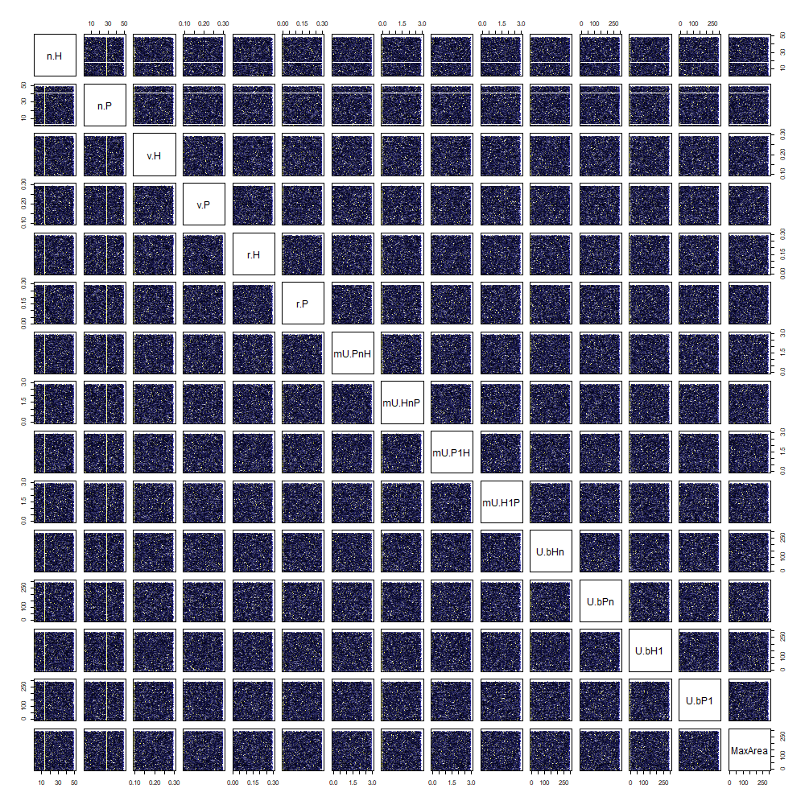
```

\newpage

## Experiment overview

```{r 5_run-experiments, include=FALSE}
### run the model for every setting according to the LHS design
if(!file.exists('exp.LHS.RData')) # you must delete "exp.LHS.RData" to create a new file
{
  
  # build cluster
  cl <- makeCluster(6)
  clusterExport(cl, 
                list('hpcModel.run', 'Fitness', 'coevo.coef', 
                     'PARS', 
                     'iniH.default', 'iniP.default', 'maxIt.default', 'tol.default'), 
                envir = environment())
  
  # loop
  exp.LHS <- run.LHS.experiment(PARS, cl)
  
  # stop cluster and clean
  stopCluster(cl)
  rm(cl)
  gc()
  
  # bind result
  exp.LHS <- do.call('rbind', exp.LHS)
  
  # build object
  exp.LHS <- cbind(PARS, exp.LHS)
  
  # save
  save(exp.LHS, file = 'exp.LHS.RData')
}
```

```{r 5_run-experiments-load, include=FALSE, dependson='5_run-experiments'}
# load
load('exp.LHS.RData')

H.evolved <- exp.LHS$timing.H > 0
P.evolved <- exp.LHS$timing.P > 0
H.exist <- !is.na(exp.LHS$H) & exp.LHS$H > 0
P.exist <- !is.na(exp.LHS$P) & exp.LHS$P > 0
```

```{r 5existHtablehtml, eval=!params$ispdf, cache=TRUE, dependson=c('5_table-functions','5_run-experiments-load')}
knitr::kable(table(H.exist), "html")
```
```{r 5existHtablepdf, eval=params$ispdf, cache=TRUE, dependson=c('5_table-functions','5_run-experiments-load')}
knitr::kable(table(H.exist), "latex")
```
```{r 5existPtablehtml, eval=!params$ispdf, cache=TRUE, dependson=c('5_table-functions','5_run-experiments-load')}
knitr::kable(table(P.exist), "html")
```
```{r 5existPtablepdf, eval=params$ispdf, cache=TRUE, dependson=c('5_table-functions','5_run-experiments-load')}
knitr::kable(table(P.exist), "latex")
```
```{r 5evolvedHtablehtml, eval=!params$ispdf, cache=TRUE, dependson=c('5_table-functions','5_run-experiments-load')}
knitr::kable(table(H.evolved), "html")
```
```{r 5evolvedHtablepdf, eval=params$ispdf, cache=TRUE, dependson=c('5_table-functions','5_run-experiments-load')}
knitr::kable(table(H.evolved), "latex")
```
```{r 5evolvedPtablehtml, eval=!params$ispdf, cache=TRUE, dependson=c('5_table-functions','5_run-experiments-load')}
knitr::kable(table(P.evolved), "html")
```
```{r 5evolvedPtablepdf, eval=params$ispdf, cache=TRUE, dependson=c('5_table-functions','5_run-experiments-load')}
knitr::kable(table(P.evolved), "latex")
```

```{r 5_overview-collapsed-plot, include=FALSE, cache=TRUE}
overview.variable.name = 'coevo'
plotScale = 10

#svg('plots/5_collapsed.svg', width=10, height=10)
png(paste0("plots/5_multiplePar-", overview.variable.name, "_collapsed-ggplot.png"),
    width = 100 * plotScale, height = 100 * plotScale)
collapsed.ggplot(exp.LHS,
                 'mU.HnP', 'coevo.H', 'coevo.P',
                 ylab = "coevolution coefficient",
                 plotScale = plotScale)
dev.off()
```

```{r 5_overview-collapsed-plot-print, dependson='5_overview-collapsed-plot', out.width = '100%'}
knitr::include_graphics(paste0("plots/5_multiplePar-", overview.variable.name, "_collapsed-ggplot.png"))
```

\newpage

### Random forest

**_Optimisation_** 

```{r 5_RF.tunning.preparation, include=FALSE}
set.seed(777)

exp.LHS.r <- exp.LHS[P.exist,]

exp.LHS.r <- exp.LHS.r[sample(1:nrow(exp.LHS.r), nrow(exp.LHS.r)),]

exp.LHS.spl <- split(as.data.frame(exp.LHS.r), 
                     f = factor(ceiling(seq_along(1:nrow(exp.LHS.r)) / 1000)))

Grid <- expand.grid(mtry = c(2:10), ntree = seq(500, 2000, 500))
```

```{r 5_RF.tunning.H, include=FALSE}
if (!file.exists('RF.coevo.H-tunning.RData')) # you must delete "RF.coevo.H-tunning.RData" to create a new file
{
  # cluster and loop
  cl <- makeCluster(6)
  clusterExport(cl, 
                list('randomForest', 'Grid', 'LHS.parameter.names', 'exp.LHS.spl'), 
                envir = environment())
  
  RF.coevo.H.tunning <- parSapply(cl, 1:nrow(Grid), function(p) {
    aux <- c()
    for (i in 1:10) {
      X <- do.call(rbind, exp.LHS.spl[-i])
      RF.coevo.H <- randomForest(
        as.formula(paste0("coevo.H ~ ", paste(LHS.parameter.names, collapse = '+'))),
        data = X,
        mtry = Grid[p, 1],
        ntree = Grid[p, 2]
      )
      acc.coevo.H <- 
        mean((predict(RF.coevo.H, exp.LHS.spl[[i]][, 1:15]) - exp.LHS.spl[[i]]$coevo.H) ^ 2)
      
      rm(RF.coevo.H)
      gc()
      
      aux[i] <- acc.coevo.H
    }
    
    return(mean(aux))
  })

  RF.coevo.H.tunning <- cbind(Grid, mean.predict = RF.coevo.H.tunning)
  # save
  save(RF.coevo.H.tunning, file = 'RF.coevo.H-tunning.RData')
}
```

```{r 5_RF.coevo.H.tunning-load, include=FALSE}
# load
load('RF.coevo.H-tunning.RData')
```

```{r 5_RF.tunning.P, include=FALSE, eval=FALSE}
if (!file.exists('RF.coevo.P-tunning.RData')) # you must delete "RF.coevo.P-tunning.RData" to create a new file
{
  # cluster and loop
  cl <- makeCluster(6)
  clusterExport(cl, 
                list('randomForest', 'Grid', 'LHS.parameter.names', 'exp.LHS.spl'), 
                envir = environment())
  
  RF.coevo.P.tunning <- parSapply(cl, 1:nrow(Grid), function(p) {
    aux <- c()
    for (i in 1:10) {
      exp.LHS.leftOneOut <- do.call(rbind, exp.LHS.spl[-i])
      RF.coevo.P <- randomForest(
        as.formula(paste0("coevo.P ~ ", paste(LHS.parameter.names, collapse = '+'))),
        data = exp.LHS.leftOneOut,
        mtry = Grid[p, 1],
        ntree = Grid[p, 2]
      )
      acc.coevo.P <- 
        mean((predict(RF.coevo.P, exp.LHS.spl[[i]][, 1:15]) - exp.LHS.spl[[i]]$coevo.P) ^ 2)
      
      rm(RF.coevo.p)
      gc()
      
      aux[i] <- acc.coevo.P
    }
    
    return(mean(aux))
  })

  RF.coevo.P.tunning <- cbind(Grid, mean.predict = RF.coevo.P.tunning)
  # save
  save(RF.coevo.P.tunning, file = 'RF.coevo.P-tunning.RData')
}
```

```{r 5_RF.coevo.P.tunning-load, include=FALSE}
# load
load('RF.coevo.P-tunning.RData')
```

```{r 5_RF.coevo.tunning-plot, dependson=c('5_RF.coevo.H.tunning-load', '5_RF.coevo.P.tunning-load'), out.width = '100%'}
temp <- cbind(
  output.var = c(
    rep('coevo.H', nrow(RF.coevo.H.tunning)), 
    rep('coevo.P', nrow(RF.coevo.P.tunning))
    ),
  rbind(RF.coevo.H.tunning, RF.coevo.P.tunning)
  )

ggplot(temp, aes(x = ntree, y = mtry)) + 
  geom_tile(aes(fill = mean.predict), colour = "white") + 
  scale_fill_gradient(low = "white", high = "black") +
  geom_text(aes(label = round(mean.predict, 5)), color = "steelblue") +
  facet_wrap(.~output.var) + theme_bw()
```

\newpage

**_Coevolution coefficients_**

Only using those runs with any humans (coevo.H) and plants (coevo.P) at the end-state.

```{r 5_RF-coevo.H, include=FALSE, cache=TRUE, dependson='5_setup_plus'}
RF.coevo.H <-
  randomForest::randomForest(
    as.formula(paste0("coevo.H ~ ", paste(LHS.parameter.names, collapse = '+'))),
    data = exp.LHS[H.exist,],
    mtry = 5,
    ntree = 1000,
    importance = T
  )
#acc.coevo.H <- mean((predict(RF.coevo.H, exp.LHS[, 1:12]) - exp.LHS$coevo.H) ^ 2)
#importance(RF.coevo.H)
```

```{r 5_RF-coevo.P, include=FALSE, cache=TRUE, dependson='5_setup_plus'}
RF.coevo.P <-
  randomForest::randomForest(
    as.formula(paste0("coevo.P ~ ", paste(LHS.parameter.names, collapse = '+'))),
    data = exp.LHS[P.exist,],
    mtry = 5,
    ntree = 1000,
    importance = T
  )
#acc.coevo.P <- mean((predict(RF.coevo.P, exp.LHS[, 1:12]) - exp.LHS$coevo.P) ^ 2)
#importance(RF.coevo.P)
```

```{r 5_RF-coevo-plots, include=FALSE, cache=TRUE}
plotScale = 2

png("plots/5_multiplePar-RF-coevo.png", width = 640 * plotScale, height = 360 * plotScale)
varImpPlot2Pair(RF.coevo.H, RF.coevo.P, cex = plotScale)
dev.off()
```

```{r 5_RF-coevo-plot-print, dependson='5_RF-coevo-plots', out.width = '100%'}
knitr::include_graphics(paste0("plots/5_multiplePar-RF-coevo.png"))
```

\newpage

**_Dependency coefficients_**

Only using those runs with any humans (depend.H) and plants (depend.P) at the end-state.

```{r 5_RF-depend.H, include=FALSE, cache=TRUE, dependson='5_setup_plus'}
RF.depend.H <-
  randomForest::randomForest(
    as.formula(paste0("depend.H ~ ", paste(LHS.parameter.names, collapse = '+'))),
    data = exp.LHS[H.exist,],
    mtry = 5,
    ntree = 1000,
    importance = T
  )
#acc.depend.H <- mean((predict(RF.depend.H, exp.LHS[, 1:12]) - exp.LHS$depend.H) ^ 2)
#importance(RF.depend.H)
```

```{r 5_RF-depend.P, include=FALSE, cache=TRUE, dependson='5_setup_plus'}
RF.depend.P <-
  randomForest::randomForest(
    as.formula(paste0("depend.P ~ ", paste(LHS.parameter.names, collapse = '+'))),
    data = exp.LHS[P.exist,],
    mtry = 5,
    ntree = 1000,
    importance = T
  )
#acc.depend.P <- mean((predict(RF.depend.P, exp.LHS[, 1:12]) - exp.LHS$depend.P) ^ 2)
#importance(RF.depend.P)
```

```{r 5_RF-depend-plots, include=FALSE, cache=TRUE}
plotScale = 2

png("plots/5_multiplePar-RF-depend.png", width = 640 * plotScale, height = 360 * plotScale)
varImpPlot2Pair(RF.depend.H, RF.depend.P, cex = plotScale)
dev.off()
```

```{r 5_RF-depend.H-plot-print, dependson='5_RF-depend-plots', out.width = '100%'}
knitr::include_graphics(paste0("plots/5_multiplePar-RF-depend.png"))
```

**_Timings_**

Only using those runs with successful human (timing.H) and plant (timing.P) evolution.

```{r 5_RF-timing.H, include=FALSE, cache=TRUE, dependson='5_setup_plus'}
RF.timing.H <-
  randomForest::randomForest(
    as.formula(paste0("timing.H ~ ", paste(LHS.parameter.names, collapse = '+'))),
    data = exp.LHS[H.evolved,], # filter out cases where humans did not evolved towards n
    mtry = 5,
    ntree = 1000,
    importance = T
  )
#acc.timing.H <- mean((predict(RF.timing.H, exp.LHS[H.evolved, 1:12]) - exp.LHS$timing.H) ^ 2)
#importance(RF.timing.H)
```

```{r 5_RF-timing.P, include=FALSE, cache=TRUE, dependson='5_setup_plus'}
RF.timing.P <-
  randomForest::randomForest(
    as.formula(paste0("timing.P ~ ", paste(LHS.parameter.names, collapse = '+'))),
    data = exp.LHS[P.evolved,], # filter out cases where plants did not evolved towards n
    mtry = 5,
    ntree = 1000,
    importance = T
  )
#acc.timing.P <- mean((predict(RF.timing.P, exp.LHS[P.evolved, 1:12]) - exp.LHS$timing.P) ^ 2)
#importance(RF.timing.P)
```

```{r 5_RF-timing-plots, include=FALSE, cache=TRUE}
plotScale = 2

png("plots/5_multiplePar-RF-timing.png", width = 640 * plotScale, height = 360 * plotScale)
varImpPlot2Pair(RF.timing.H, RF.timing.P, cex = plotScale)
dev.off()
```

```{r 5_RF-timing.H-plot-print, dependson='5_RF-timing-plots', out.width = '100%'}
knitr::include_graphics(paste0("plots/5_multiplePar-RF-timing.png"))
```

\newpage

### Trajectories

```{r 5_exp.LHS.trajectories, include=FALSE}
number.trajectories = 5

set.seed(777)
  
randomSample <- sample(1:nrow(PARS), number.trajectories)

PARS.sample <- PARS[randomSample,]

# build cluster
cl <- makeCluster(6)
clusterExport(cl, 
              list('hpcModel.run', 'Fitness', 'coevo.coef', 
                   'PARS.sample', 
                   'iniH.default', 'iniP.default', 'maxIt.default', 'tol.default'), 
              envir = environment())

# loop
exp.LHS.trajectories.list <- run.LHS.experiment2(PARS.sample, cl)

# stop cluster and clean
stopCluster(cl)
rm(cl)
gc()

# build object
exp.LHS.trajectories <- c()

for (runIndex in 1:number.trajectories)
{
  exp.LHS.trajectories <- rbind(
    exp.LHS.trajectories,
    cbind(
      run = rep(runIndex, nrow(exp.LHS.trajectories.list[[runIndex]])),
      time = 1:(nrow(exp.LHS.trajectories.list[[runIndex]])),
      exp.LHS.trajectories.list[[runIndex]][,c('H', 'P', 'coevo.H', 'coevo.P')]
    )
  )
}

exp.LHS.trajectories <- exp.LHS.trajectories[!is.na(exp.LHS.trajectories$H) & exp.LHS.trajectories$H > 0,]

rm(exp.LHS.trajectories.list)

# save
save(exp.LHS.trajectories, file = 'exp.LHS.trajectories.RData')
```

```{r 5_overview-trajectories-plot, include=FALSE, cache=TRUE}
load('exp.LHS.trajectories.RData')

overview.variable.name = 'pop'

plotScale = 10

png(paste0("plots/5_multiplePar-", overview.variable.name, "_trajectories-ggplot.png"),
    width = 100 * plotScale, height = 50 * plotScale)

trajectories.ggplot(exp.LHS.trajectories, 
                    c('H', 'P'), c('coevo.H', 'coevo.P'),
                    'Populations', 'Coevolution coefficients',
                    cex = plotScale)

dev.off()
```

```{r 5_overview-trajectories-plot-print, dependson='5_overview-trajectories-plot', out.width = '100%'}
knitr::include_graphics(paste0("plots/5_multiplePar-", overview.variable.name, "_trajectories-ggplot.png"))
```

\newpage

## Scenarios

```{r 5_split-scenarios, include=FALSE, cache=TRUE, dependson='5_run-experiments-load'}
# exp.LHS.scenarios.names <- c(
#   'plantImprove', 'humanImprove', 'bothImprove',
#   'plantLessBase', 'humanLessBase', 'bothLessBase'
# )

# # mU.PnH > mU.P1H (mutualistic plant types give more utility = TRUE, else = FALSE)
exp.LHS_plantImprove <- factor(as.character(exp.LHS$mU.PnH > exp.LHS$mU.P1H),
                               levels = c('TRUE', 'FALSE'),
                               labels = c('mU.PnH > mU.P1H', 
                                          'mU.PnH <= mU.P1H')
                               )

# # mU.HnP > mU.H1P (mutualistic human types give more utility = TRUE, else = FALSE)
exp.LHS_humanImprove <- factor(as.character(exp.LHS$mU.HnP > exp.LHS$mU.H1P),
                               levels = c('TRUE', 'FALSE'),
                               labels = c('mU.HnP > mU.H1P',
                                          'mU.HnP <= mU.H1P'))

# # mU.PnH > mU.P1H AND mU.HnP > mU.H1P (mutualistic types give more utility = TRUE, else = FALSE)
exp.LHS_bothImprove <- factor(as.character(exp.LHS$mU.PnH > exp.LHS$mU.P1H & exp.LHS$mU.HnP > exp.LHS$mU.H1P),
                              levels = c('TRUE', 'FALSE'),
                              labels = c('mU.PnH > mU.P1H ~~~ AND ~~~ mU.HnP > mU.H1P', 
                                         'mU.PnH <= mU.P1H ~~~ AND ~~~ mU.HnP <= mU.H1P'))

# # U.bP1 > U.bPn (non-mutualistic plant types obtain more utility from other resources = TRUE, else = FALSE)
exp.LHS_plantLessBase <- factor(as.character(exp.LHS$U.bP1 > exp.LHS$U.bPn),
                                levels = c('TRUE', 'FALSE'),
                                labels = c('U.bP1 > U.bPn',
                                           'U.bP1 <= U.bPn'))

# # U.bH1 > U.bHn (non-mutualistic human types obtain more utility from other resources = TRUE, else = FALSE)
exp.LHS_humanLessBase <- factor(as.character(exp.LHS$U.bH1 > exp.LHS$U.bHn),
                                levels = c('TRUE', 'FALSE'),
                                labels = c('U.bH1 > U.bHn',
                                           'U.bH1 <= U.bHn'))

# # mU.PnH > mU.P1H AND mU.HnP > mU.H1P (non-mutualistic types obtain more utility from other resources = TRUE, else = FALSE)
exp.LHS_bothLessBase <- factor(as.character(exp.LHS$U.bP1 > exp.LHS$U.bPn & exp.LHS$U.bH1 > exp.LHS$U.bHn),
                               levels = c('TRUE', 'FALSE'),
                               labels = c('mU.PnH > mU.P1H ~~~ AND ~~~ mU.HnP > mU.H1P',
                                          'mU.PnH <= mU.P1H ~~~ AND ~~~ mU.HnP <= mU.H1P'))
```

### Mutualistic human type gives more utility ($\bar{U}_{H_{n}P}> \bar{U}_{H_{1}P}$)
\sectionmark{Scenario: $\bar{U}_{H_{n}P}> \bar{U}_{H_{1}P}$}

**_Coevolution coefficients_**

```{r 5_scenarios-humanImprove-coevo-plots, include=FALSE, cache=TRUE, dependson=c('5_run-experiments', '5_run-experiments-load', '5_split-scenarios')}

plotScale = 10

#svg('plots/5_collapsed.svg', width=10, height=10)
png("plots/5_multiplePar-coevo-humanImprove-ggplot.png",
    width = 200 * plotScale,
    height = 100 * plotScale
)
parameter.x.scenario.ggplot(exp.LHS, 
                            LHS.parameter.names,
                            'coevo.H', 'coevo.P',
                            scenarioSplitter = exp.LHS_humanImprove,
                            ylab = "coevolution coefficient",
                            plotScale = plotScale)
dev.off()
```

```{r 5_scenarios-humanImprove-coevo-plot-print, dependson='5_scenarios-humanImprove-coevo-plot', out.width = '100%'}
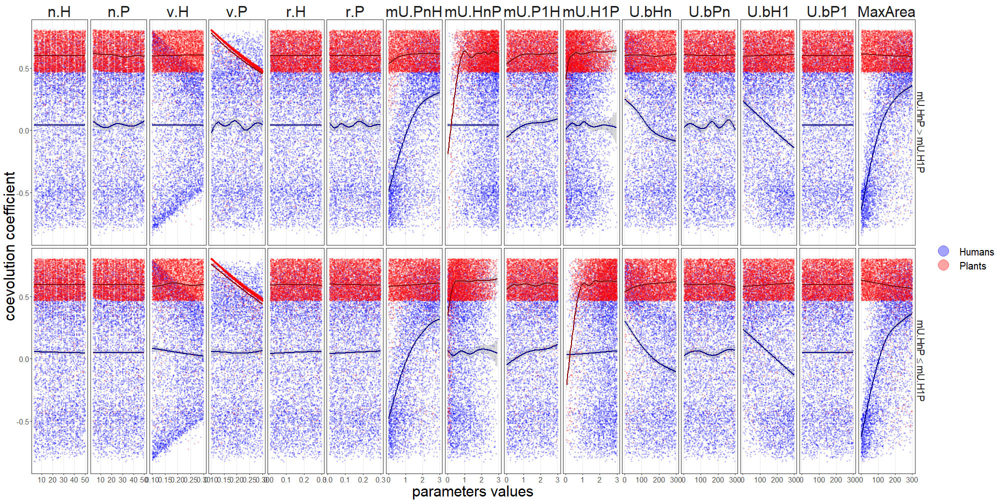
```

**_Dependency coefficients_**

```{r 5_scenarios-humanImprove-depend-plots, include=FALSE, cache=TRUE, dependson=c('5_run-experiments', '5_run-experiments-load', '5_split-scenarios')}

plotScale = 10

#svg('plots/5_collapsed.svg', width=10, height=10)
png("plots/5_multiplePar-depend-humanImprove-ggplot.png",
    width = 200 * plotScale,
    height = 100 * plotScale
)
parameter.x.scenario.ggplot(exp.LHS, 
                            LHS.parameter.names,
                            'depend.H', 'depend.P',
                            scenarioSplitter = exp.LHS_humanImprove,
                            ylab = "dependency coefficient",
                            plotScale = plotScale,
                            y.log = TRUE)
dev.off()
```

```{r 5_scenarios-humanImprove-depend-plot-print, dependson='5_scenarios-humanImprove-depend-plot', out.width = '100%'}
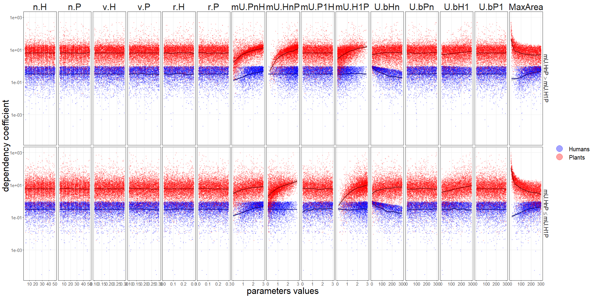
```

**_Timings_**

```{r 5_scenarios-humanImprove-timing-plots, include=FALSE, cache=TRUE, dependson=c('5_run-experiments', '5_run-experiments-load', '5_split-scenarios')}

plotScale = 10

#svg('plots/5_collapsed.svg', width=10, height=10)
png("plots/5_multiplePar-timing-humanImprove-ggplot.png",
    width = 200 * plotScale,
    height = 100 * plotScale
)
parameter.x.scenario.ggplot(exp.LHS, 
                            LHS.parameter.names,
                            'timing.H', 'timing.P',
                            scenarioSplitter = exp.LHS_humanImprove,
                            ylab = "Timing",
                            plotScale = plotScale,
                            y.log = TRUE)
dev.off()
```

```{r 5_scenarios-humanImprove-timing-plot-print, dependson='5_scenarios-humanImprove-timing-plot', out.width = '100%'}
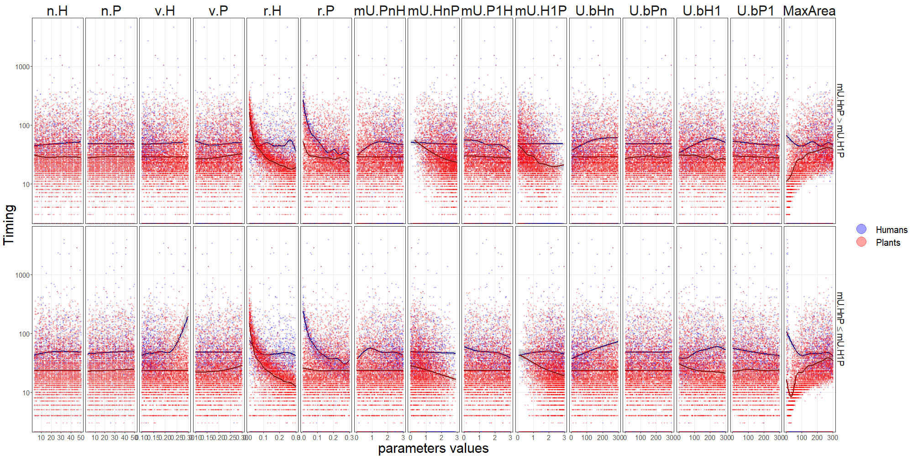
```

\newpage

### Mutualistic plant type gives more utility ($\bar{U}_{P_{n}H}> \bar{U}_{P_{1}H}$)
\sectionmark{Scenario: $\bar{U}_{P_{n}H}> \bar{U}_{P_{1}H}$}

**_Coevolution coefficients_**

```{r 5_scenarios-plantImprove-coevo-plots, include=FALSE, cache=TRUE, dependson=c('5_run-experiments', '5_run-experiments-load', '5_split-scenarios')}

plotScale = 10

#svg('plots/5_collapsed.svg', width=10, height=10)
png("plots/5_multiplePar-coevo-plantImprove-ggplot.png",
    width = 200 * plotScale,
    height = 100 * plotScale
)
parameter.x.scenario.ggplot(exp.LHS, 
                            LHS.parameter.names,
                            'coevo.H', 'coevo.P',
                            scenarioSplitter = exp.LHS_plantImprove,
                            ylab = "coevolution coefficient",
                            plotScale = plotScale)
dev.off()
```

```{r 5_scenarios-plantImprove-coevo-plot-print, dependson='5_scenarios-plantImprove-coevo-plot', out.width = '100%'}
knitr::include_graphics("plots/5_multiplePar-coevo-plantImprove-ggplot.png")
```

**_Dependency coefficients_**

```{r 5_scenarios-plantImprove-depend-plots, include=FALSE, cache=TRUE, dependson=c('5_run-experiments', '5_run-experiments-load', '5_split-scenarios')}

plotScale = 10

#svg('plots/5_collapsed.svg', width=10, height=10)
png("plots/5_multiplePar-depend-plantImprove-ggplot.png",
    width = 200 * plotScale,
    height = 100 * plotScale
)
parameter.x.scenario.ggplot(exp.LHS, 
                            LHS.parameter.names,
                            'depend.H', 'depend.P',
                            scenarioSplitter = exp.LHS_plantImprove,
                            ylab = "dependency coefficient",
                            plotScale = plotScale,
                            y.log = TRUE)
dev.off()
```

```{r 5_scenarios-plantImprove-depend-plot-print, dependson='5_scenarios-plantImprove-depend-plot', out.width = '100%'}
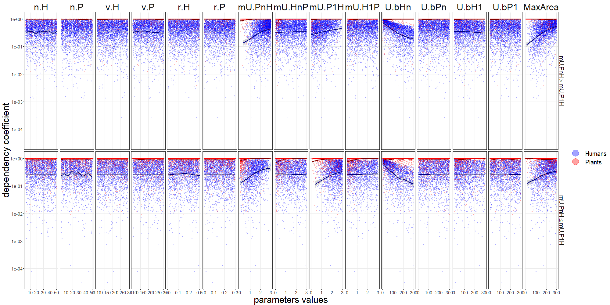
```

**_Timings_**

```{r 5_scenarios-plantImprove-timing-plots, include=FALSE, cache=TRUE, dependson=c('5_run-experiments', '5_run-experiments-load', '5_split-scenarios')}

plotScale = 10

#svg('plots/5_collapsed.svg', width=10, height=10)
png("plots/5_multiplePar-timing-plantImprove-ggplot.png",
    width = 200 * plotScale,
    height = 100 * plotScale
)
parameter.x.scenario.ggplot(exp.LHS, 
                            LHS.parameter.names,
                            'timing.H', 'timing.P',
                            scenarioSplitter = exp.LHS_plantImprove,
                            ylab = "Timing",
                            plotScale = plotScale,
                            y.log = TRUE)
dev.off()
```

```{r 5_scenarios-plantImprove-timing-plot-print, dependson='5_scenarios-plantImprove-timing-plot', out.width = '100%'}
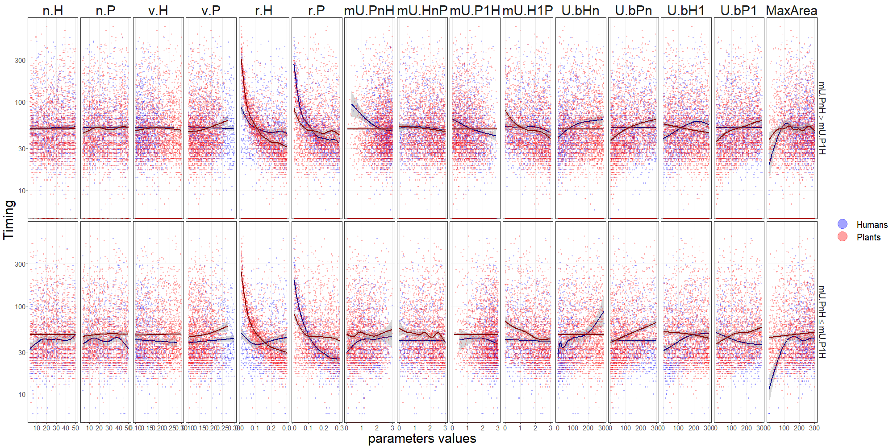
```

\newpage

### Mutualistic types (human and plant) give more utility ($\bar{U}_{H_{n}P}> \bar{U}_{H_{1}P}$ AND $\bar{U}_{P_{n}H}> \bar{U}_{P_{1}H}$)
\sectionmark{$\bar{U}_{H_{n}P}> \bar{U}_{H_{1}P}$ AND $\bar{U}_{P_{n}H}> \bar{U}_{P_{1}H}$}

**_Coevolution coefficients_**

```{r 5_scenarios-bothImprove-coevo-plots, include=FALSE, cache=TRUE, dependson=c('5_run-experiments', '5_run-experiments-load', '5_split-scenarios')}

plotScale = 10

#svg('plots/5_collapsed.svg', width=10, height=10)
png("plots/5_multiplePar-coevo-bothImprove-ggplot.png",
    width = 200 * plotScale,
    height = 100 * plotScale
)
parameter.x.scenario.ggplot(exp.LHS, 
                            LHS.parameter.names,
                            'coevo.H', 'coevo.P',
                            scenarioSplitter = exp.LHS_bothImprove,
                            ylab = "coevolution coefficient",
                            plotScale = plotScale)
dev.off()
```

```{r 5_scenarios-bothImprove-coevo-plot-print, dependson='5_scenarios-bothImprove-coevo-plot', out.width = '100%'}
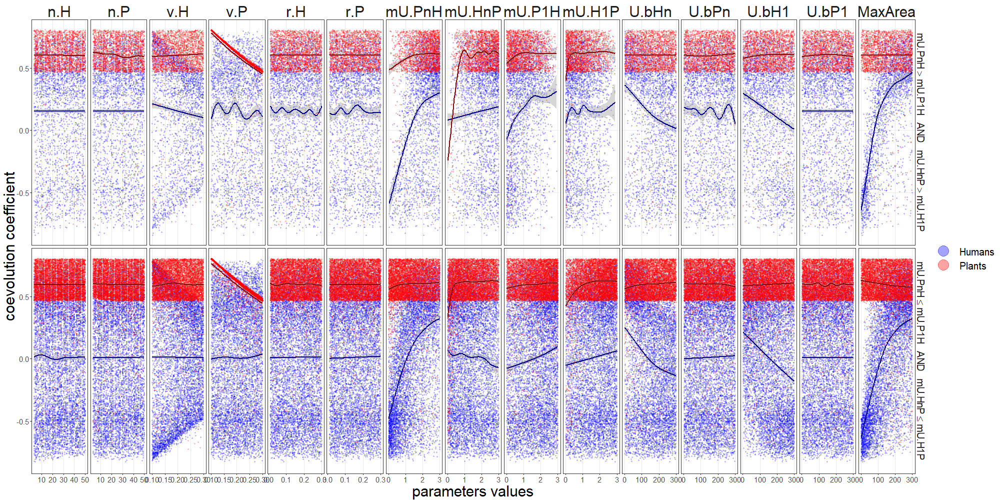
```

**_Dependency coefficients_**

```{r 5_scenarios-bothImprove-depend-plots, include=FALSE, cache=TRUE, dependson=c('5_run-experiments', '5_run-experiments-load', '5_split-scenarios')}

plotScale = 10

#svg('plots/5_collapsed.svg', width=10, height=10)
png("plots/5_multiplePar-depend-bothImprove-ggplot.png",
    width = 200 * plotScale,
    height = 100 * plotScale
)
parameter.x.scenario.ggplot(exp.LHS, 
                            LHS.parameter.names,
                            'depend.H', 'depend.P',
                            scenarioSplitter = exp.LHS_bothImprove,
                            ylab = "dependency coefficient",
                            plotScale = plotScale,
                            y.log = TRUE)
dev.off()
```

```{r 5_scenarios-bothImprove-depend-plot-print, dependson='5_scenarios-bothImprove-depend-plot', out.width = '100%'}
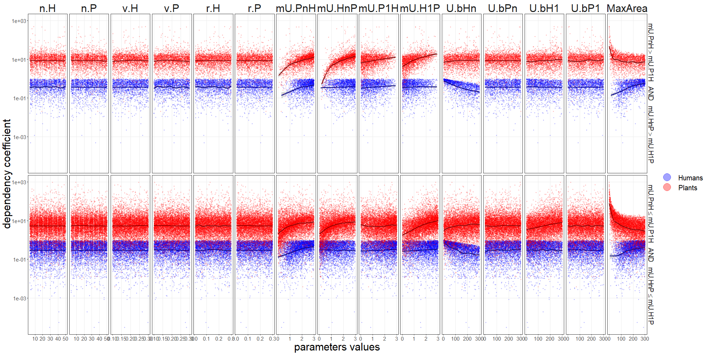
```

**_Timings_**

```{r 5_scenarios-bothImprove-timing-plots, include=FALSE, cache=TRUE, dependson=c('5_run-experiments', '5_run-experiments-load', '5_split-scenarios')}

plotScale = 10

#svg('plots/5_collapsed.svg', width=10, height=10)
png("plots/5_multiplePar-timing-bothImprove-ggplot.png",
    width = 200 * plotScale,
    height = 100 * plotScale
)
parameter.x.scenario.ggplot(exp.LHS, 
                            LHS.parameter.names,
                            'timing.H', 'timing.P',
                            scenarioSplitter = exp.LHS_bothImprove,
                            ylab = "Timing",
                            plotScale = plotScale,
                            y.log = TRUE)
dev.off()
```

```{r 5_scenarios-bothImprove-timing-plot-print, dependson='5_scenarios-bothImprove-timing-plot', out.width = '100%'}
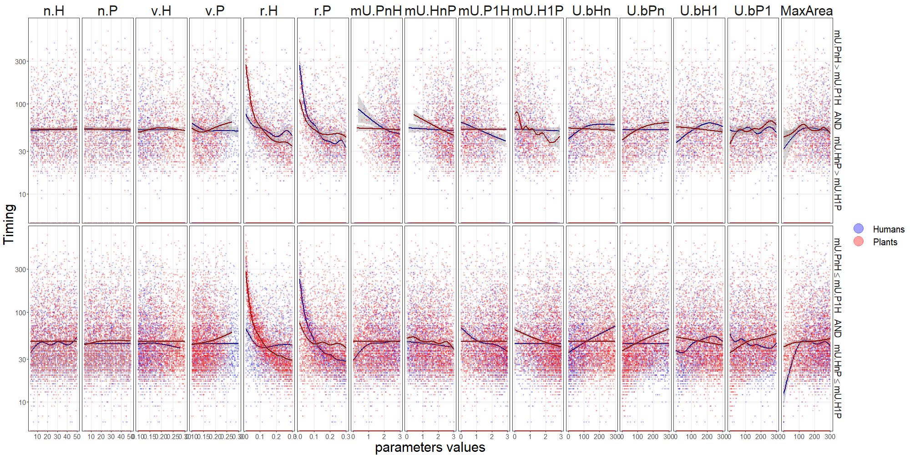
```

\newpage

### Mutualistic human type gets less utility from other resources ($U_{bH_{1}}>U_{bH_{n}}$)
\sectionmark{Scenario: $U_{bH_{1}}>U_{bH_{n}}$}

**_Coevolution coefficients_**

```{r 5_scenarios-humanLessBase-coevo-plots, include=FALSE, cache=TRUE, dependson=c('5_run-experiments', '5_run-experiments-load', '5_split-scenarios')}

plotScale = 10

#svg('plots/5_collapsed.svg', width=10, height=10)
png("plots/5_multiplePar-coevo-humanLessBase-ggplot.png",
    width = 200 * plotScale,
    height = 100 * plotScale
)
parameter.x.scenario.ggplot(exp.LHS, 
                            LHS.parameter.names,
                            'coevo.H', 'coevo.P',
                            scenarioSplitter = exp.LHS_humanLessBase,
                            ylab = "coevolution coefficient",
                            plotScale = plotScale)
dev.off()
```

```{r 5_scenarios-humanLessBase-coevo-plot-print, dependson='5_scenarios-humanLessBase-coevo-plot', out.width = '100%'}
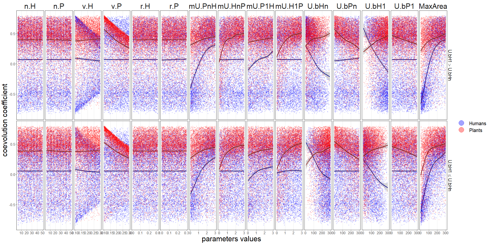
```

**_Dependency coefficients_**

```{r 5_scenarios-humanLessBase-depend-plots, include=FALSE, cache=TRUE, dependson=c('5_run-experiments', '5_run-experiments-load', '5_split-scenarios')}

plotScale = 10

#svg('plots/5_collapsed.svg', width=10, height=10)
png("plots/5_multiplePar-depend-humanLessBase-ggplot.png",
    width = 200 * plotScale,
    height = 100 * plotScale
)
parameter.x.scenario.ggplot(exp.LHS, 
                            LHS.parameter.names,
                            'depend.H', 'depend.P',
                            scenarioSplitter = exp.LHS_humanLessBase,
                            ylab = "dependency coefficient",
                            plotScale = plotScale,
                            y.log = TRUE)
dev.off()
```

```{r 5_scenarios-humanLessBase-depend-plot-print, dependson='5_scenarios-humanLessBase-depend-plot', out.width = '100%'}
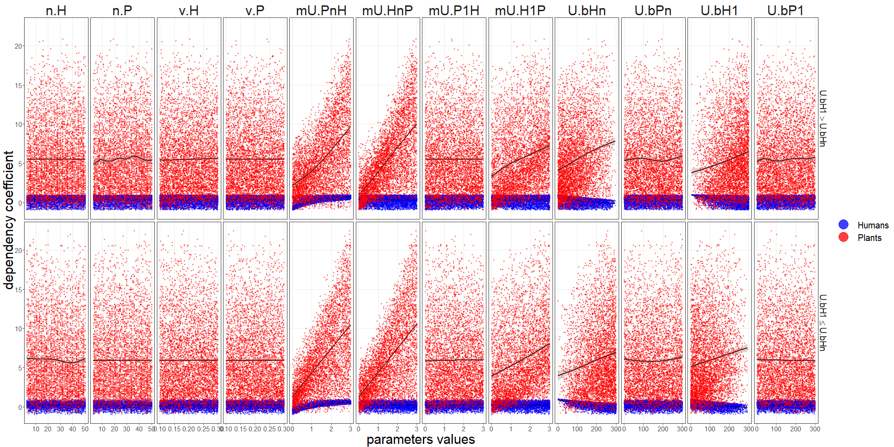
```

**_Timings_**

```{r 5_scenarios-humanLessBase-timing-plots, include=FALSE, cache=TRUE, dependson=c('5_run-experiments', '5_run-experiments-load', '5_split-scenarios')}

plotScale = 10

#svg('plots/5_collapsed.svg', width=10, height=10)
png("plots/5_multiplePar-timing-humanLessBase-ggplot.png",
    width = 200 * plotScale,
    height = 100 * plotScale
)
parameter.x.scenario.ggplot(exp.LHS, 
                            LHS.parameter.names,
                            'timing.H', 'timing.P',
                            scenarioSplitter = exp.LHS_humanLessBase,
                            ylab = "Timing",
                            plotScale = plotScale,
                            y.log = TRUE)
dev.off()
```

```{r 5_scenarios-humanLessBase-timing-plot-print, dependson='5_scenarios-humanLessBase-timing-plot', out.width = '100%'}
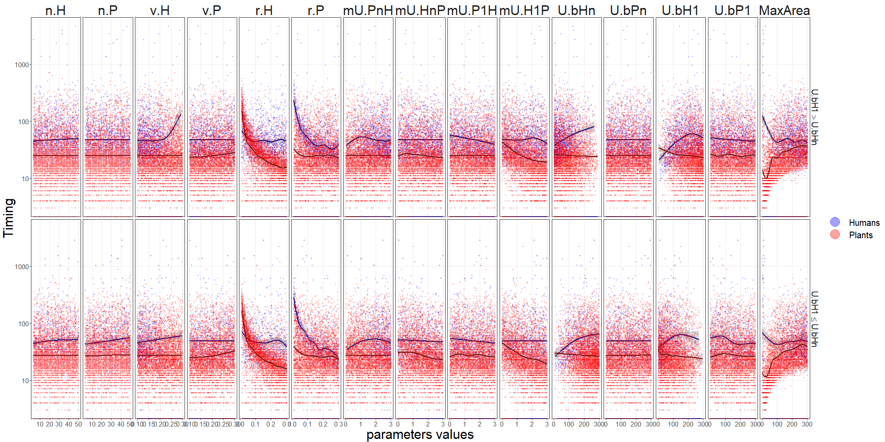
```

\newpage

### Mutualistic plant type gets less utility from other resources ($U_{bP_{1}}>U_{bP_{n}}$)
\sectionmark{Scenario: $U_{bP_{1}}>U_{bP_{n}}$}

**_Coevolution coefficients_**

```{r 5_scenarios-plantLessBase-coevo-plots, include=FALSE, cache=TRUE, dependson=c('5_run-experiments', '5_run-experiments-load', '5_split-scenarios')}

plotScale = 10

#svg('plots/5_collapsed.svg', width=10, height=10)
png("plots/5_multiplePar-coevo-plantLessBase-ggplot.png",
    width = 200 * plotScale,
    height = 100 * plotScale
)
parameter.x.scenario.ggplot(exp.LHS, 
                            LHS.parameter.names,
                            'coevo.H', 'coevo.P',
                            scenarioSplitter = exp.LHS_plantLessBase,
                            ylab = "coevolution coefficient",
                            plotScale = plotScale)
dev.off()
```

```{r 5_scenarios-plantLessBase-coevo-plot-print, dependson='5_scenarios-plantLessBase-coevo-plot', out.width = '100%'}
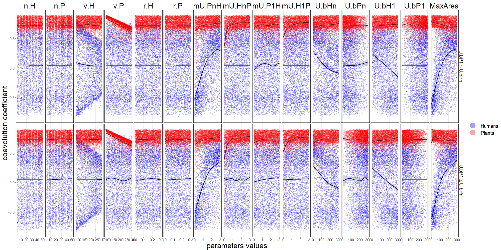
```

**_Dependency coefficients_**

```{r 5_scenarios-plantLessBase-depend-plots, include=FALSE, cache=TRUE, dependson=c('5_run-experiments', '5_run-experiments-load', '5_split-scenarios')}

plotScale = 10

#svg('plots/5_collapsed.svg', width=10, height=10)
png("plots/5_multiplePar-depend-plantLessBase-ggplot.png",
    width = 200 * plotScale,
    height = 100 * plotScale
)
parameter.x.scenario.ggplot(exp.LHS, 
                            LHS.parameter.names,
                            'depend.H', 'depend.P',
                            scenarioSplitter = exp.LHS_plantLessBase,
                            ylab = "dependency coefficient",
                            plotScale = plotScale,
                            y.log = TRUE)
dev.off()
```

```{r 5_scenarios-plantLessBase-depend-plot-print, dependson='5_scenarios-plantLessBase-depend-plot', out.width = '100%'}
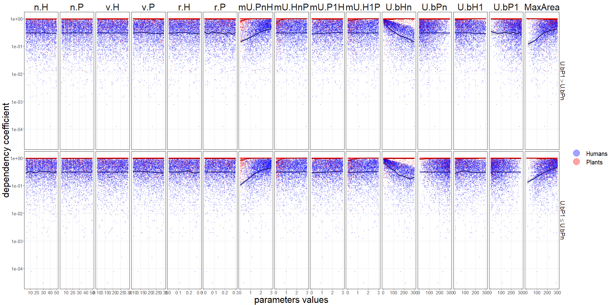
```

**_Timings_**

```{r 5_scenarios-plantLessBase-timing-plots, include=FALSE, cache=TRUE, dependson=c('5_run-experiments', '5_run-experiments-load', '5_split-scenarios')}

plotScale = 10

#svg('plots/5_collapsed.svg', width=10, height=10)
png("plots/5_multiplePar-timing-plantLessBase-ggplot.png",
    width = 200 * plotScale,
    height = 100 * plotScale
)
parameter.x.scenario.ggplot(exp.LHS, 
                            LHS.parameter.names,
                            'timing.H', 'timing.P',
                            scenarioSplitter = exp.LHS_plantLessBase,
                            ylab = "Timing",
                            plotScale = plotScale,
                            y.log = TRUE)
dev.off()
```

```{r 5_scenarios-plantLessBase-timing-plot-print, dependson='5_scenarios-plantLessBase-timing-plot', out.width = '100%'}
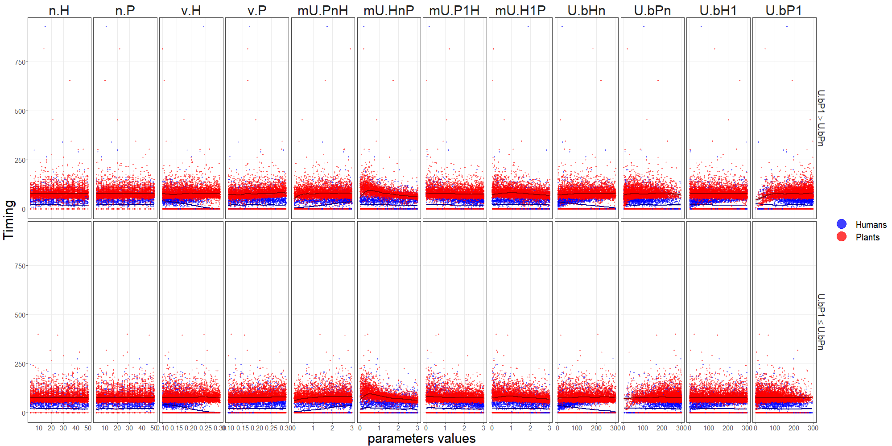
```

\newpage

### Mutualistic types (human and plant) get less utility from other resources ($U_{bH_{1}}>U_{bH_{n}}$ AND $U_{bP_{1}}>U_{bP_{n}}$)
\sectionmark{Scenario: $U_{bH_{1}}>U_{bH_{n}}$ AND $U_{bP_{1}}>U_{bP_{n}}$}

**_Coevolution coefficients_**

```{r 5_scenarios-bothLessBase-coevo-plots, include=FALSE, cache=TRUE, dependson=c('5_run-experiments', '5_run-experiments-load', '5_split-scenarios')}

plotScale = 10

#svg('plots/5_collapsed.svg', width=10, height=10)
png("plots/5_multiplePar-coevo-bothLessBase-ggplot.png",
    width = 200 * plotScale,
    height = 100 * plotScale
)
parameter.x.scenario.ggplot(exp.LHS, 
                            LHS.parameter.names,
                            'coevo.H', 'coevo.P',
                            scenarioSplitter = exp.LHS_bothLessBase,
                            ylab = "coevolution coefficient",
                            plotScale = plotScale)
dev.off()
```

```{r 5_scenarios-bothLessBase-coevo-plot-print, dependson='5_scenarios-bothLessBase-coevo-plot', out.width = '100%'}
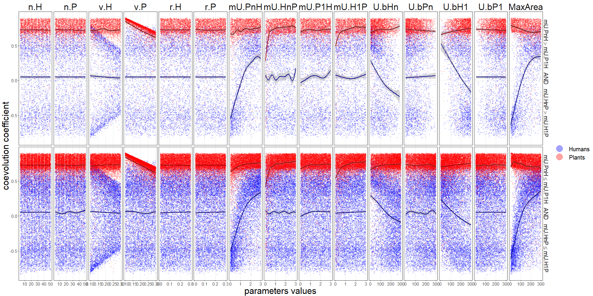
```

**_Dependency coefficients_**

```{r 5_scenarios-bothLessBase-depend-plots, include=FALSE, cache=TRUE, dependson=c('5_run-experiments', '5_run-experiments-load', '5_split-scenarios')}

plotScale = 10

#svg('plots/5_collapsed.svg', width=10, height=10)
png("plots/5_multiplePar-depend-bothLessBase-ggplot.png",
    width = 200 * plotScale,
    height = 100 * plotScale
)
parameter.x.scenario.ggplot(exp.LHS, 
                            LHS.parameter.names,
                            'depend.H', 'depend.P',
                            scenarioSplitter = exp.LHS_bothLessBase,
                            ylab = "dependency coefficient",
                            plotScale = plotScale,
                            y.log = TRUE)
dev.off()
```

```{r 5_scenarios-bothLessBase-depend-plot-print, dependson='5_scenarios-bothLessBase-depend-plot', out.width = '100%'}
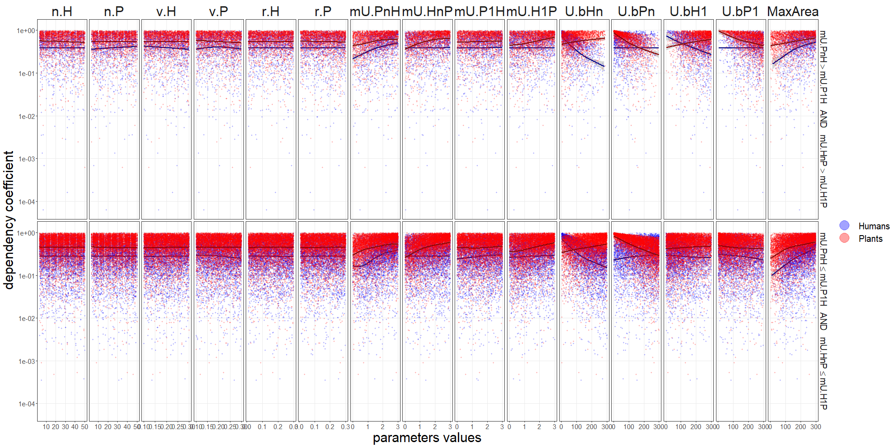
```

**_Timings_**

```{r 5_scenarios-bothLessBase-timing-plots, include=FALSE, cache=TRUE, dependson=c('5_run-experiments', '5_run-experiments-load', '5_split-scenarios')}

plotScale = 10

#svg('plots/5_collapsed.svg', width=10, height=10)
png("plots/5_multiplePar-timing-bothLessBase-ggplot.png",
    width = 200 * plotScale,
    height = 100 * plotScale
)
parameter.x.scenario.ggplot(exp.LHS, 
                            LHS.parameter.names,
                            'timing.H', 'timing.P',
                            scenarioSplitter = exp.LHS_bothLessBase,
                            ylab = "Timing",
                            plotScale = plotScale,
                            y.log = TRUE)
dev.off()
```

```{r 5_scenarios-bothLessBase-timing-plot-print, dependson='5_scenarios-bothLessBase-timing-plot', out.width = '100%'}
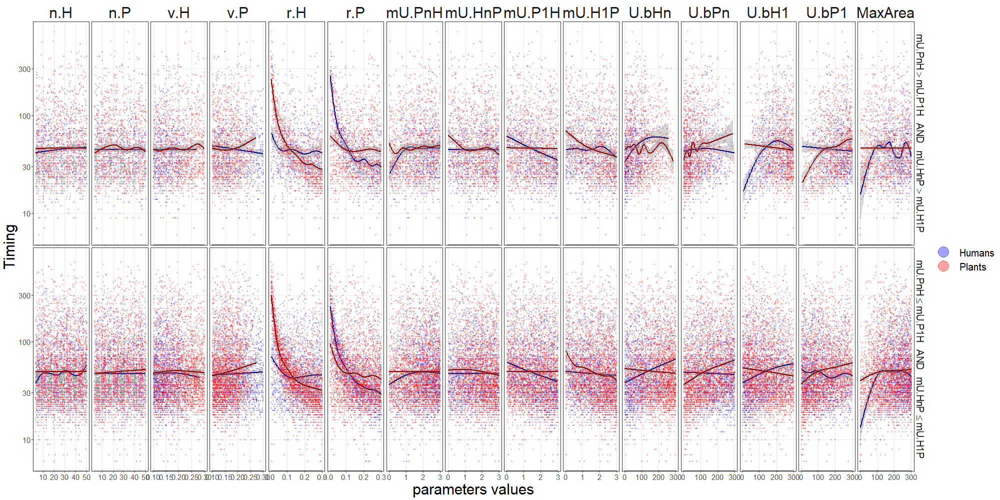
```

