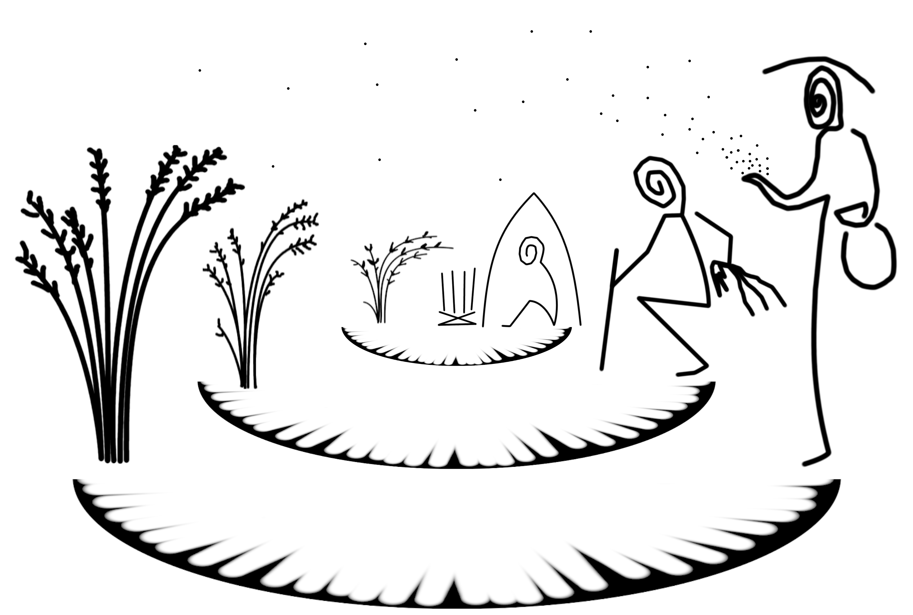

# Human-Plant Coevolution model 

Contents related to the Human-Plant Coevolution model implemented in R. 

This repository includes the source files for model, exploration and analyses (`library/`) and documentation of the HPC model (`index.Rmd`), the sensitive analysis report (all other Rmarkdown files in the root directory), and a user interface for running and visualising simulations (`hpcShinyApp/`). 

The entire repository is the directory of an [R](https://www.r-project.org/) Project that runs in [RStudio](https://www.rstudio.com/). Download it to consult and use all files locally. It was created and tested with R 3.6.2 and should be mostly compatible with later versions. There are no package dependency for running the model code (`library/hpcModel.(...).R` files).

To re-run all experiment analyses (both R and Rmd scripts), the following packages and minimum versions must be installed: ggplot2 (3.3.1), scales (1.1.1), reshape2 (1.4.4), ggpubr (0.4.0), randomForest (4.6-14), kableExtra (0.3.4), magick (2.7.2). Specifically to use the magick package for creating the GIF animations (`plots/runPlot/(...).gif`), it is required to download and install 'Image Magick' (7.1.0): https://imagemagick.org/. To re-compile the html booklet the following packages are also needed: knitr (1.33), bookdown (0.22). The Shiny app was built with shiny (1.6.0).

Alternatively, explore the following online features:

- Explore single simulation runs using the Shiny App hosted in ShinyApps.io: https://andros-spica.shinyapps.io/HPCShinyApp/

- Consult the HTML version of the model description and the sensitivity analysis report: https://andros-spica.github.io/hpcModel

- See our a presentation overviewing the model and its results, hosted in another repository: https://github.com/Andros-Spica/ENE-Angourakis-et-al-2019

Dedicated article: 
>Angourakis, A., Alcaina-Mateos, J., Madella, M., and Zurro, D. (to be anounced) *Human-Plant Coevolution: a modelling framework for theory-building on the origin of agriculture*.

Cite this repository as:

>Angourakis, Andreas, & Alcaina-Mateos, Jonas. (2022, May 23). Andros-Spica/hpcModel: Human-Plant Coevolution model: source files, simulation interface, sensitivity analysis report and documentation (Version v1.2). Zenodo. http://doi.org/10.5281/zenodo.3881916
