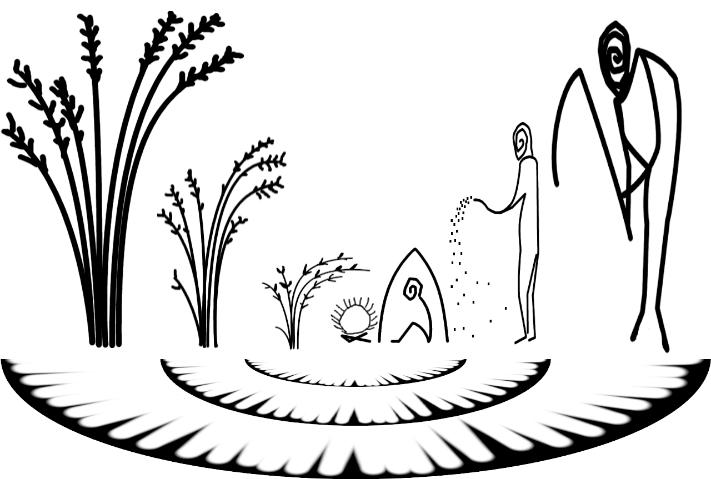

# _______ { - }

```{r cover-logo, echo=FALSE, eval=!params$ispdf, out.width = '100%'}

```

# Model overview { - }

The Human-Plant Coevolution (HPC) model represents the dynamics of coevolution between a human and a plant population. The model consists of an ecological positive feedback system (mutualism), which can be reinforced by positive evolutionary feedback (coevolution). The model is the result of wiring together relatively simple simulation models of population ecology and evolution, through a computational implementation in R.

\newpage

**_Parameters_**

 R notation     | Math notation | Description
 -------------- | ------------- | ---------------------
 `iniH`, `iniP` | $ini_{H},\,ini_{P}$ | **initial populations of humans and plants**  
 `n.H`, `n.P`   | $n_{H},\,n_{P}$ | **number of types of humans and plants**. The number of phenotypic variants of each population that relate to human-plant coevolution. Types are arbitrarily ordered from type $1$ (*less* mutualistic) to type $n$ (*more* mutualistic).  
 `v.H`, `v.P`   | $v_{H},\,v_{P}$ | **level of undirected variation in humans and plants**. For any value greater than zero, these parameters regulate how even is the distribution of a population among its types.  
 `r.H`, `r.P`   | $r_{H},\,r_{P}$ | **intrinsic growth rates for human and plant populations**. The maximum rate at which a population grows when there are no external constraints.  
 `mU.PnH`       | $\bar{U}_{P_{n}H}$ | utility per capita of **type** $n$ **plants** to **humans**  
 `mU.HnP`       | $\bar{U}_{H_{n}P}$ | utility per capita of **type** $n$ **humans** to **plants**  
 `mU.P1H`       | $\bar{U}_{P_{1}H}$ | utility per capita of **type** $1$ **plants** to **humans**  
 `mU.H1P`       | $\bar{U}_{H_{1}P}$ | utility per capita of **type** $1$ **humans** to **plants**  
 `U.bH1`       | $U_{bH_{1}}$ | utility of **other resources** to **type** $1$ **humans** or the baseline carrying capacity for humans of type $1$; i.e. that independent of plants.    
 `U.bP1`       | $U_{bP_{1}}$ | utility of **other resources** to **type** $1$ **plants** or the baseline carrying capacity for plants of type $1$; i.e. that independent of humans.   (non-anthropic space)  
 `U.bHn`       | $U_{bH_{n}}$ | utility of **other resources** to **type** $n$ **humans** or the baseline carrying capacity for humans of type $n$, i.e. that independent of plants  
 `U.bPn`       | $U_{bP_{n}}$ | utility of **other resources** to **type** $n$ **plants** or the baseline carrying capacity for plants of type $n$; i.e. that independent of humans.  
 `MaxArea`      | $MaxArea$ | **Maximum contiguous area to be used by plants**. It is used as the maximum carrying capacity for plants.  

Table: Parameters

\newpage

R notation              | Math notation | Description 
 ---------------------- | ------------- | ---------------------
 `H`, `P`               | $H[t],\,P[t]$ | **Human and plant populations** at time $t$. Population units are abstract, arbitrarily defined units that can express individuals, working hours, households, etc. (humans), and sprouts, certain amount of biomass, soil surface, etc. (plants)  
 `K.H`, `K.P`           | $K_{H}[t],\,K_{P}[t]$ | **Carrying capacity** to human and plant populations or maximum population at time $t$, expressed in population units  
 `U.HP`, `U.PH`         | $U_{HP}[t],\,U_{PH}[t]$ | **Utility of one population to the other** or the total contribution of a population to the maximum population at time $t$, expressed in population units  
 `U.bH`, `U.bP`         | $U_{bH}[t],\,U_{bP}[t]$ | **Utility of other resources to a population** at time $t$, expressed in population units (baseline carrying capacity)  
 `types.H`, `types.P`         | $types_{H},\,types_{P}$ | Population types, arbitrarily ordered from $1$ to $n$ (vector or array).  
 `pop.H`, `pop.P`         | $pop_{H_{i}}[t],\,pop_{P_{i}}[t]$ | **Proportion of a population** belonging to type $i$ at time $t$ (vector or array).  
 `mU.HP.per.type`, `mU.PH.per.type`         | $\bar{U}_{H_{i}P},\,\bar{U}_{P_{i}H}$ | **Utility per capita** of type $i$ individuals of one population to the other (vector or array).  
 `U.bH.per.type`, `U.bP.per.type`         | $U_{bH_{i}},\,U_{bP_{i}}$ | **Utility of other resources** to type $i$ individuals of a population (vector or array).  
 `fitness.H`, `fitness.P`         | $fitness_{H_{i}}[t],\,fitness_{P_{i}}[t]$ | **Fitness score** of type $i$ individuals of a population at time $t$ (vector or array).  
 `d.H`, `d.P`         | $\Delta H[t],\,\Delta P[t]$ | **Population change** (*delta*) at time $t$ in respect to time $t -1$ (vector or array).  

Table: Variables

\newpage

 R notation             | Math notation | Description        
 ---------------------- | ------------- | ---------------------
 `coevo.H`, `coevo.P`   | $coevo_{H},\,coevo_{P}$ | **Coevolution coefficients**. A coefficient representing the distribution of the proportion of a population  per type ($pop_{A_1}$ to $pop_{A_n}$) weighted by type index ($1$ to $n$). Each indicates *if* and *how much* the population distribution has been modified by the coevolutionary process. Their values range between -1, the entire population is of type $1$, and 1, the entire population is of type $n$.  
 `depend.H`, `depend.P` | $depend_{H},\,depend_{P}$ | **Dependency coefficients**. The slope of the linear model of the fitness score per type ($fitness_{A_1}$ to $fitness_{A_n}$) using type index ($1$ to $n$). Indicate *if* and *how much* the overall fitness score of a population is dependent on the other population.  
 `timing.H`, `timing.P` | $timing_{H},\,timing_{P}$ | **Iterations past** until **coevolution** successfully changes the proportions of population per type; generally, when $pop_{A_1}\gg pop_{A_n}$ or, more specifically, $coevo_A>timing.threshold$.  
 `time`                 | $t_{end}$ | **Iterations past** until the **end state** (*stationary point*)

Table: Variables (output only)
