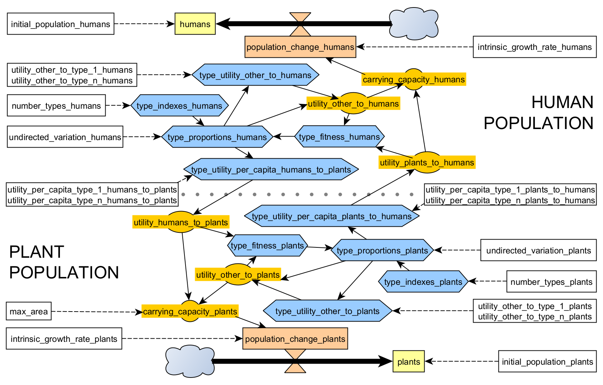

# _______ { - }

```{r cover-logo, echo=FALSE, eval=!params$ispdf, out.width = '100%'}
knitr::include_graphics("images/hpcModel-logo_v3.png")
```

# Model overview { - }

The Human-Plant Coevolution (HPC) model represents the dynamics of coevolution between a human and a plant population. The model consists of an ecological positive feedback system (mutualism), which can be reinforced by positive evolutionary feedback (coevolution). The model is the result of wiring together relatively simple simulation models of population ecology and evolution, through a computational implementation in R.

```{r infographic, echo=FALSE, eval=!params$ispdf, out.width = '100%'}
knitr::include_graphics("images/infograph.png")
```

\newpage

## Ecological relationships and population dynamics { - }

The model can be expressed by a relatively simple system of two discrete-time difference equations (Eq. 1 and 2), based on the Verhulst-Pearl Logistic equation [chapter 9, @Kingsland1982; @Pianka1974]. The change of both populations ($\Delta H[t]$, $\Delta P[t]$; see Table 3) depends on an intrinsic growth rate ($r_{H}, r_{P}$), the population at a given time ($H[t]$, $P[t]$) and the respective carrying capacity of the environment for each population ($K_{H}[t]$, $K_{P}[t]$), which may vary over time.

\begin{equation}
\tag{Eq. 1}
H[t+1]=H[t]+r_{H}H[t]-r_{H}\frac{H[t]^{2}}{K_{H}[t]}
\end{equation}

\begin{equation}
\tag{Eq. 2}
P[t+1]=P[t]+r_{P}P[t]-r_{P}\frac{P[t]^{2}}{K_{P}[t]}
\end{equation}

Human and plant populations engage in a mutualistic relationship, where one species is to some extent sustained by the other (Eq. 3 and 4). The mutualistic relationship is defined in the model as an increment of the carrying capacity of population B caused by population A ($U_{AB}[t]$). This increment, expressed as the utility of A to B at a given time is the product of the utility per capita of A to B ($\bar{U}_{AB}$) and the population A at a given time (Eq. 5 and 6).

We consider that both populations are sustained also by an independent term, representing the baseline carrying capacity of the environment or the utility gain from other resources, which is time-dependent ($U_{bH}[t]$, $U_{bP}[t]$). While we assume that the growth of the human population has no predefined ceiling, the expansion of the plant population is considered limited as the area over which plants can grow contiguously ($MaxArea$), and represented as a compendium of both space and the maximum energy available in a discrete location (Eq. 4).

\begin{equation}
\tag{Eq. 3}
K_{H}[t]=U_{PH}[t]+U_{bH}[t]
\end{equation}

\begin{equation}
\tag{Eq. 4}
K_{P}[t]=\min(U_{HP}[t]+U_{bP}[t],\, MaxArea)
\end{equation}

\begin{equation}
\tag{Eq. 5}
U_{HP}[t]=H[t]\cdot \bar{U}_{HP}
\end{equation}

\begin{equation}
\tag{Eq. 6}
U_{PH}[t]=P[t]\cdot \bar{U}_{PH}
\end{equation}

Considering that mutualistic relationships involve a positive feedback loop, the population growth at time t improves the conditions for both humans and plants at time $t + 1$, sustaining their growth even further.

 Domains                     | Assumptions  
 --------------------------  | ---------------------------- |
 On interacting populations  | A population of humans interacts with a population of plants
 On population growth	       | Population growth is a self-catalyzing process, where the population density in the present will contribute to its own increase in the future, depending on an intrinsic growth rate (*r*)
  &#xfeff;                       | Population growth is a self-limiting process, where the population density in the present will constraint its own increase in the future, depending on respective carrying capacity of the environment (*K*)
  &#xfeff;                       | The logistic growth model is acceptable as an approximation to the dynamics of populations, both human and plant, under constant conditions
  &#xfeff;                       | The carrying capacity of the environment for a population depends on constant factors and on a time-varying factor (*K[t]*)
 On positive ecological relationships | Positive ecological relationships exist, where an individual of one population increases by an amount the carrying capacity of the environment for another population
  &#xfeff;                       | Coupled positive ecological relationships (i.e., mutualism) exist, where two populations increase the carrying capacities for each other
  &#xfeff;                       | There is variation in positive ecological relationships, so individuals of one population vary in terms of how much they increase the carrying capacity for the other population
 On human-plant mutualism    | A given plant species yield a positive utility for humans, e.g., as a source of food and raw materials
  &#xfeff;                       | Humans return a positive utility for this plant species, e.g., by improving soil conditions
  &#xfeff;                       | The utility given by one population adds value to the carrying capacity for the other, and vice versa
  &#xfeff;                       | The carrying capacity for humans rely also in other resources, which are independent of the plant species (i.e., the baseline carrying capacity for humans)
  &#xfeff;                       | The carrying capacity for plants rely also in other conditions, which are independent of humans (i.e., the baseline carrying capacity for plants)
  &#xfeff;                       | The carrying capacity for plants is eventually constrained by the space available for it to grow contiguously as a population (i.e., maximum area)

Table: Assumptions on ecological relationships and population dynamics

\newpage

## Population diversity { - }

The HPC model contemplates a vector (pop) of length n, containing the population fractions of each type. The number of types are population-specific and are given as two parameters ($n_{H}$, $n_{P}$). These types include all possible variations within a population so that this vector amounts to the unity ($\sum_{i=1}^{n}{pop_{A_{i}}}=1$).

To account for multiple types, we replace Eq. 5 and 6 with Eq. 7 and 8, where the utility of population A to B at any given time ($U_{AB}[t]$) is calculated by summing up the utility per capita of each type ($\bar{U}_{A_{i}B}$) proportionally to the share of population of the respective type ($pop_{A_{i}}[t]$), and multiplying the result by the population at a given time. The baseline carrying capacity ($U_{bA_{i}}[t]$) is calculated in a similar manner, though using the utility that each type is able to gain from other resources ($U_{bA_{i}}$) (Eq. 9 and 10). 

\begin{equation}
\tag{Eq. 7}
U_{HP}[t]=H[t]\sum_{i=1}^{n_{H}}{pop_{H_{i}}[t]\cdot \bar{U}_{H_{i}P}}
\end{equation}

\begin{equation}
\tag{Eq. 8}
U_{PH}[t]=P[t]\sum_{i=1}^{n_{P}}{pop_{P_{i}}[t]\cdot \bar{U}_{P_{i}H}}
\end{equation}

\begin{equation}
\tag{Eq. 9}
U_{bH}[t]=\sum_{i=1}^{n_{H}}{pop_{H_{i}}[t]\cdot U_{bH_{i}}}
\end{equation}

\begin{equation}
\tag{Eq. 10}
U_{bP}[t]=\sum_{i=1}^{n_{P}}{pop_{P_{i}}[t]\cdot U_{bP_{i}}}
\end{equation}

Types relate to population-specific values of utility per capita ($\bar{U}_{A_{i}B}$) and baseline carrying capacity ($U_{bA_{i}}$). These values are defined by linear interpolation between pairs of parameters representing the values corresponding to types $1$ and $n$ (e.g., if $n_P=10$, $\bar{U}_{P_{1}H}=1$ and $\bar{U}_{P_{n}H}=10$, then $\bar{U}_{P_{5}H}=5$). The shares of population within types follow a one-tail distribution rather than a normal distribution, which would be more adequate but less straightforward to use in a theoretical model. Under this circumstance, the distribution of population within types will always be biased towards the intermediate types.
 
## Coevolutionary dynamics { - }

Undirected variation, which causes part of the population to randomly change to other types, represents the effect of mutation in genetic transmission or of innovation, error, and other mechanisms in cultural transmission. The balance of the subpopulation A of type $i$ depends on the level of undirected variation ($v_{A}$) and on the degree and sign of the difference between the current subpopulation ($pop_{A_{i}}[t]$) and the averaged subpopulation ($1/n_{A}$), which refers to the completely uniform distribution among types (Eq. 11 and 12). 

\begin{equation}
\tag{Eq. 11}
pop_{H}[t]'=pop_{H}[t]+v_{H}\left(\tfrac{1}{n_{H}}-pop_{H}[t]\right)
\end{equation}


\begin{equation}
\tag{Eq. 12}
pop_{P}[t]'=pop_{P}[t]+v_{P}\left(\tfrac{1}{n_{P}}-pop_{P}[t]\right)
\end{equation}

By considering inertia, we are assuming that the more frequent a type is, the more likely that it is transmitted. Selection is implemented by assigning a fitness score to each type ($fitness_{A_{i}}[t]$), which in turn biases its transmission. Equations 13 and 14 summarizes the combined effect that inertia and selection have on the proportion of population A belonging to type $i$ ($pop_{A_{i}}[t]$) [for a formal similarity of the discrete replicator dynamic and Bayesian inference see Harper2009].

\begin{equation}
\tag{Eq. 13}
pop_{H_{i}}[t+1]=\frac{fitness_{H_{i}}[t]\cdot pop_{H_{i}}[t]}{\sum_{j=1}^{n_{H}}fitness_{H_{j}}[t]\cdot pop_{H_{j}}[t]}
\end{equation}

\begin{equation}
\tag{Eq. 14}
pop_{P_{i}}[t+1]=\frac{fitness_{P_{i}}[t]\cdot pop_{P_{i}}[t]}{\sum_{j=1}^{n_{P}}fitness_{P_{j}}[t]\cdot pop_{P_{j}}[t]}
\end{equation}

This mechanism defines how a trait evolves in a single population. However, coevolution can also be represented when the selective pressure on this population is modified by the changing traits of another population. In order to link the two populations, fitness scores of population A are derived from the weight of the contribution or utility of population B ($U_{BA}[t]$) in relation to the base carrying capacity of A ($K_{A}[t]$) (Eq. 10).

\begin{equation}
\tag{Eq. 15}
fitness_{H_{i}}[t]=\frac{(n_{H}-i)\,U_{bH}[t]+i\,U_{PH}[t]}{U_{bH}[t]+U_{PH}[t]}
\end{equation}

\begin{equation}
\tag{Eq. 16}
fitness_{P_{i}}[t]=\frac{(n_{P}-i)\,U_{bP}[t]+i\,U_{HP}[t]}{U_{bP}[t]+U_{HP}[t]}
\end{equation}

As a consequence of this model design, types of both human and plant populations span from a non-mutualistic type ($i=1$), which has the best fitness score when there is no positive interaction with the other population ($U_{BA}[t]\approx 0$), to a mutualistic type ($i=n$), which is the optimum when nearly the whole of the carrying capacity is due to such relationship ($U_{BA}[t]\approx K_{A}[t]$).

 Domains                     | Assumptions  
 --------------------------  | ---------------------------- |
 On the evolution of traits  | A population can be divided into types according to one or more traitsThe distribution of individuals among types can vary in time, due to factors affecting trait transmission
 On the factors affecting the evolution of traits | Change of the population distribution among types depends on the previous population distribution: the more frequent is a type, the more likely it will be imitated or transmitted to the next generation
 &#xfeff;                        | Change of the population distribution among types depends on the relative fitness of types: the greater the fitness score associated to a type, the more likely it will be imitated or transmitted to the next generation
 &#xfeff;                        | Change of the population distribution among types depends on undirected variation
 On the coevolution of traits related to human-plant mutualism | The utility given by an individual varies within types
 &#xfeff;                        | The utility given by other resources to a population varies within its types
 &#xfeff;                        | The fitness of human types is modified by the relative weight of plant utility in the carrying capacity for humansThe fitness of plant types is modified to the relative weight of human utility in the carrying capacity for plants

Table: Assumptions on population diversity and coevolution

\newpage

## Parameters and variables { - }

```{r forrester-diagram, echo=FALSE, eval=!params$ispdf, out.width = '100%'}

```

 R notation     | Math notation | Description
 -------------- | ------------- | ---------------------
 `initial_population_humans`, `initial_population_plants` | $ini_{H},\,ini_{P}$ | **initial populations of humans and plants**  
 `number_types_humans`, `number_types_plants`   | $n_{H},\,n_{P}$ | **number of types of humans and plants**. The number of phenotypic variants of each population that relate to human-plant coevolution. Types are arbitrarily ordered from type $1$ (*less* mutualistic) to type $n$ (*more* mutualistic).  
 `undirected_variation_humans`, `undirected_variation_plants`   | $v_{H},\,v_{P}$ | **level of undirected variation in humans and plants**. For any value greater than zero, these parameters regulate how even is the distribution of a population among its types.  
 `intrinsic_growth_rate_humans`, `intrinsic_growth_rate_plants`   | $r_{H},\,r_{P}$ | **intrinsic growth rates for human and plant populations**. The maximum rate at which a population grows when there are no external constraints.  
 `utility_per_capita_type_n_plants_to_humans`       | $\bar{U}_{P_{n}H}$ | utility per capita of **type** $n$ **plants** to **humans**  
 `utility_per_capita_type_1_plants_to_humans`       | $\bar{U}_{P_{1}H}$ | utility per capita of **type** $1$ **plants** to **humans**  
 `utility_per_capita_type_n_humans_to_plants`       | $\bar{U}_{H_{n}P}$ | utility per capita of **type** $n$ **humans** to **plants**  
 `utility_per_capita_type_1_humans_to_plants`       | $\bar{U}_{H_{1}P}$ | utility per capita of **type** $1$ **humans** to **plants**   
 `utility_other_to_type_n_plants`       | $U_{bP_{n}}$ | utility of **other resources** to **type** $n$ **plants** or the baseline carrying capacity for plants of type $n$; i.e. that independent of humans.  
 `utility_other_to_type_1_plants`       | $U_{bP_{1}}$ | utility of **other resources** to **type** $1$ **plants** or the baseline carrying capacity for plants of type $1$; i.e. that independent of humans.   (non-anthropic space)  
 `utility_other_to_type_n_humans`       | $U_{bH_{n}}$ | utility of **other resources** to **type** $n$ **humans** or the baseline carrying capacity for humans of type $n$, i.e. that independent of plants.  
 `utility_other_to_type_1_humans`       | $U_{bH_{1}}$ | utility of **other resources** to **type** $1$ **humans** or the baseline carrying capacity for humans of type $1$; i.e. that independent of plants.   
 `max_area`      | $MaxArea$ | **Maximum number of plant population units fitting the contiguous area available**. It is used as the maximum carrying capacity for plants.  
 **Simulation flow control** |  |  
 `max_iterations`      | $time_{max}$ | maximum number of iterations allowed before halting a simulation run.
 `reltol_exponential`      | $\epsilon$ | base 10 negative exponential controlling how small population change must be to halt a simulation run.   
 `coevolution_threshold`      | $coevo_{\theta}$ | value between -1 and 1 to which to compare coevolution coefficients and decide if qualitative shift in type proportions has happened, so timing can be registered (see "Table: Variables (output only)" below).   

Table: Parameters


R notation              | Math notation | Description 
 ---------------------- | ------------- | ---------------------
 `humans`, `plants`               | $H[t],\,P[t]$ | **Human and plant populations** at time $t$. Population units are abstract, arbitrarily defined units that can express individuals, working hours, households, etc. (humans), and sprouts, certain amount of biomass, soil surface, etc. (plants)  
 `carrying_capacity_humans`, `carrying_capacity_plants`           | $K_{H}[t],\,K_{P}[t]$ | **Carrying capacity** to human and plant populations or maximum population at time $t$, expressed in population units  
 `utility_humans_to_plants`, `utility_plants_to_humans`         | $U_{HP}[t],\,U_{PH}[t]$ | **Utility of one population to the other** or the total contribution of a population to the carrying capacity of the other population at time $t$, expressed in population units  
 `utility_other_to_humans`, `utility_other_to_plants`         | $U_{bH}[t],\,U_{bP}[t]$ | **Utility of other resources to a population** at time $t$, expressed in population units (baseline carrying capacity)  
 `type_indexes_humans`, `type_indexes_plants`         | $types_{H},\,types_{P}$ | **Population types**, arbitrarily ordered from $1$ to $n$ (vector or array).  
 `type_proportions_humans`, `type_proportions_plants`         | $pop_{H_{i}}[t],\,pop_{P_{i}}[t]$ | **Proportion of a population** belonging to each type at time $t$ (vector or array).  
 `type_utility_per_capita_humans_to_plants`, `type_utility_per_capita_plants_to_humans`         | $\bar{U}_{H_{i}P},\,\bar{U}_{P_{i}H}$ | **Utility per capita** of type $i$ individuals of one population to the other (vector or array).  
 `type_utility_other_to_humans`, `type_utility_other_to_plants`         | $U_{bH_{i}},\,U_{bP_{i}}$ | **Utility of other resources** to type $i$ individuals of a population (vector or array).  
 `type_fitness_humans`, `type_fitness_plants`         | $fitness_{H_{i}}[t]$, $fitness_{P_{i}}[t]$ | **Fitness score** of type $i$ individuals of a population at time $t$ (vector or array).  
 `population_change_humans`, `population_change_plants`         | $\Delta H[t],\,\Delta P[t]$ | **Population change** (*delta*) at time $t$ in respect to time $t -1$ (vector or array).  
 

Table: Variables

\newpage

## End-states { - }

A simulation ends when both populations and their respective type distributions are stable; i.e no further change occurs given current conditions. More specifically, we use the *RelTol* method to decide if the absolute difference between the populations between time $t$ and $t-1$ are very small, less than $10^{-\epsilon}$ (see `reltol_exponential` in "Table: Parameters") where $\epsilon=6$ in our default setting. End-states defined by unchanged variables are known as stationary points. Exceptionally, under certain parameter settings, the HPC model does not converge into a stationary point but enters an oscillatory state. To handle these rare cases and others producing extremely slow-paced dynamics, simulations are interrupted regardless of the conditions after a certain number of iterations ($time_{max}$ or `max_iterations`).

\newpage

## Output variables { - }

The most important output variables are the coevolution coefficients ($coevo_H$, $coevo_P$), which measure the trend in the distribution of a population among its types. 

\begin{equation}
\tag{Eq. 17}
coevo_H[t]=\frac{\sum_{i=1}^{n_H}pop_{H_i}[t] * (types_{H_i} - 1))}{n_H - 1} * 2 - 1
\end{equation}

\begin{equation}
\tag{Eq. 18}
coevo_P[t]=\frac{\sum_{i=1}^{n_P}pop_{P_i}[t] * (types_{P_i} - 1))}{n_P - 1} * 2 - 1
\end{equation}

The dependency coefficients ($depend_H$, $depend_P$) express the direction and intensity of the selective pressure caused by the other population. It is calculated as the slope coefficient of a linear model of the fitness scores ($fitness_A[t]$) using the type indexes ($types_A$) as an independent variable. 

Positive values of both these coefficients reflect the tendency of a population towards the most mutualistic types (effective coevolution), while negative values indicate an inclination towards the non-mutualistic type due to a low selective pressure exerted by the mutualistic relationship.

We recorded the time step at the end of simulations ($time_{end}$), obtaining a measure of the overall duration of the process. Whenever applicable, we register the duration of change towards more mutualistic types in both populations ($timing_H, timing_P$). We consider change to be effective when the respective coevolution coefficient is greater than 0.5 (`coevolution_threshold`, in the implementation in R), meaning that at least half of the population is concentrated on the higher quarter of the type spectrum.

 R notation             | Math notation | Description        
 ---------------------- | ------------- | ---------------------
 `coevolution_coefficient_humans`, `coevolution_coefficient_plants`   | $coevo_{H},\,coevo_{P}$ | **Coevolution coefficients**. A coefficient representing the distribution of the proportion of a population  per type ($pop_{A_1}$ to $pop_{A_n}$) weighted by type index ($1$ to $n$). Each indicates *if* and *how much* the population distribution has been modified by the coevolutionary process. Their values range between -1, the entire population is of type $1$, and 1, the entire population is of type $n$.  
 `dependency_coefficient_humans`, `dependency_coefficient_plants` | $depend_{H},\,depend_{P}$ | **Dependency coefficients**. The slope of the linear model of the fitness score per type ($fitness_{A_1}$ to $fitness_{A_n}$) using type index ($1$ to $n$). Indicate *if* and *how much* the overall fitness score of a population is dependent on the other population.  
 `timing_humans`, `timing_plants` | $timing_{H},\,timing_{P}$ | **Iterations past** until **coevolution** successfully changes the proportions of population per type; generally, when $pop_{A_1}\gg pop_{A_n}$ or, more specifically, $coevo_A>coevo_{\theta}$.  
 `time_end`                 | $t_{end}$ | **Iterations past** until the **end state** (*stationary point*)

Table: Variables (output only)

\newpage

## Experimental design { - }

Although relatively simple, the HPC model has a total of 17 parameters. We did not engage in fixing any of these parameters to fit a particular case study as a strategy to reduce the complexity of results. In turn, as our aim is to explore theoretical grounds, we scrutinised the ‘multiverse’ of scenarios that potentially represent the relationship between any given human population and any given plant species. The complexity of the model was managed by exploring the parameter space progressively, observing the multiplicity of cases in single runs, two and four parameter explorations, and an extensive exploration including 15 parameters (all, except $ini_H$ and $ini_P$). The latter type of exploration was performed by simulating 10.000 parameter settings sampled with the Latin Hypercube Sampling (LHS) technique [@McKay1979a] and Strauss optimization [@Damblin2013]. All simulation runs were executed for a maximum of 5.000 time steps.
